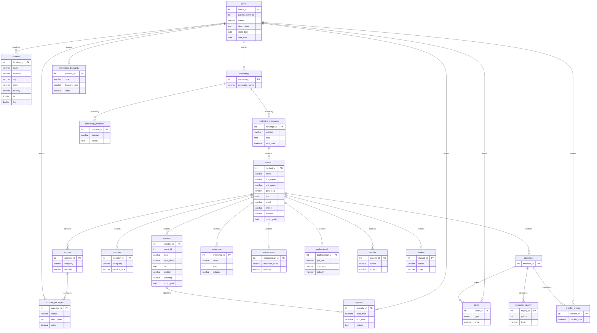

# graphql-tutorial
GraphQL with Golang Tutorial

## Preparation
1. Set Database path in cmd/server/.env => DB_NAME=/path/events.db  
2. Initial Sqlite database structure by run command at "migratios/init-tables.go"
```sh
go run init-tables.go
```
    Check database file at "path/events.db".

    Use sql admin tools to check data structures.


## Data Structure


## Coding Steps
1. Create a model in folder models.
```go
package models

// Contact represents a contact record in the database
type Contact struct {
	ContactID  int    `json:"contact_id"`
	Name       string `json:"name"`
	FirstName  string `json:"first_name"`
	LastName   string `json:"last_name"`
	GenderID   int    `json:"gender_id"`
	DOB        string `json:"dob"`
	Email      string `json:"email"`
	Phone      string `json:"phone"`
	Address    string `json:"address"`
	PhotoPath  string `json:"photo_path"`
}

```
2. Create a repository to manage data from data source.
```go
package repositories

import (
	"fmt"
	"github.com/apaichon/graphql-tutorial/database"
	"github.com/apaichon/graphql-tutorial/models"
	_ "github.com/mattn/go-sqlite3"
)

// ContactRepo represents the repository for contact operations
type ContactRepo struct {
	DB *database.DB
}

// NewContactRepo creates a new instance of ContactRepo
func NewContactRepo() *ContactRepo {
	db :=database.NewDB()
	return &ContactRepo{DB: db}
}


// GetContacts fetches contacts from the database with support for text search, limit, and offset
func (cr *ContactRepo) GetContactsBySearchText(searchText string, limit, offset int) ([]*models.Contact, error) {
	var contacts []*models.Contact

	query := fmt.Sprintf(`
		SELECT * FROM contact 
		WHERE name LIKE '%%%s%%' OR email LIKE '%%%s%%' OR address LIKE '%%%s%%'
		LIMIT ? OFFSET ?
	`, searchText, searchText, searchText)

	rows, err := cr.DB.Query(query, limit, offset)
	if err != nil {
		return nil, err
	}
	defer rows.Close()

	for rows.Next() {
		var contact models.Contact
		err := rows.Scan(
			&contact.ContactID,
			&contact.Name,
			&contact.FirstName,
			&contact.LastName,
			&contact.GenderID,
			&contact.DOB,
			&contact.Email,
			&contact.Phone,
			&contact.Address,
			&contact.PhotoPath,
		)
		if err != nil {
			return nil, err
		}
		contacts = append(contacts, &contact)
	}

	if err := rows.Err(); err != nil {
		return nil, err
	}

	return contacts, nil
}


// GetAllContacts retrieves all contacts from the database
func (cr *ContactRepo) GetAllContacts() ([]*models.Contact, error) {
	// Execute query to get all contacts from the database
	rows, err := cr.DB.Query("SELECT * FROM contact")
	if err != nil {
		return nil, err
	}
	defer rows.Close()

	// Iterate over the result set and map to Contact struct
	var contacts []*models.Contact
	for rows.Next() {
		var contact models.Contact
		err := rows.Scan(
			&contact.ContactID,
			&contact.Name,
			&contact.FirstName,
			&contact.LastName,
			&contact.GenderID,
			&contact.DOB,
			&contact.Email,
			&contact.Phone,
			&contact.Address,
			&contact.PhotoPath,
		)
		if err != nil {
			return nil, err
		}
		contacts = append(contacts, &contact)
	}
	return contacts, nil
}

// GetContactByID retrieves a contact by its ID from the database
func (cr *ContactRepo) GetContactByID(id int) (*models.Contact, error) {
	var contact models.Contact
	// Execute query to get a contact by ID from the database
	row, err := cr.DB.QueryRow("SELECT * FROM contact WHERE contact_id = ?", id)

	// Map the result to Contact struct
	
	if err != nil {
		return &contact, nil
	 }

	row.Scan(
		&contact.ContactID,
		&contact.Name,
		&contact.FirstName,
		&contact.LastName,
		&contact.GenderID,
		&contact.DOB,
		&contact.Email,
		&contact.Phone,
		&contact.Address,
		&contact.PhotoPath,
	)

	return &contact, nil
}


// InsertContact inserts a new contact into the database
func (cr *ContactRepo) InsertContact(contact *models.Contact) (int64, error) {
	// Execute insert query to insert a new contact into the database
	result, err := cr.DB.Insert("INSERT INTO contact (name, first_name, last_name, gender_id, dob, email, phone, address, photo_path) VALUES (?, ?, ?, ?, ?, ?, ?, ?, ?)",
		contact.Name, contact.FirstName, contact.LastName, contact.GenderID, contact.DOB, contact.Email, contact.Phone, contact.Address, contact.PhotoPath)
	if err != nil {
		return 0, err
	}
	return result.LastInsertId()
}

// UpdateContact updates an existing contact in the database
func (cr *ContactRepo) UpdateContact(contact *models.Contact) (int64, error) {
	// Execute update query to update an existing contact in the database
	result, err := cr.DB.Update("UPDATE contact SET name=?, first_name=?, last_name=?, gender_id=?, dob=?, email=?, phone=?, address=?, photo_path=? WHERE contact_id=?",
		contact.Name, contact.FirstName, contact.LastName, contact.GenderID, contact.DOB, contact.Email, contact.Phone, contact.Address, contact.PhotoPath, contact.ContactID)
	if err != nil {
		return 0, err
	}
	return result.RowsAffected()
}

// DeleteContact deletes a contact from the database
func (cr *ContactRepo) DeleteContact(id int) (int64, error) {
	// Execute delete query to delete a contact from the database
	result, err := cr.DB.Delete("DELETE FROM contact WHERE contact_id=?", id)
	if err != nil {
		return 0, err
	}
	return result.RowsAffected()
}

```
3. Create a graphql type in folder graphql/types
```go
package types

import (
	"github.com/graphql-go/graphql"
	"github.com/apaichon/graphql-tutorial/models"
)

var ContactGraphQLType = graphql.NewObject(graphql.ObjectConfig{
	Name: "Contact",
	Fields: graphql.Fields{
		"contact_id": &graphql.Field{Type: graphql.Int},
		"name":       &graphql.Field{Type: graphql.String},
		"first_name": &graphql.Field{Type: graphql.String},
		"last_name":  &graphql.Field{Type: graphql.String},
		"gender_id":  &graphql.Field{Type: graphql.Int},
		"dob":        &graphql.Field{Type: graphql.String},
		"email":      &graphql.Field{Type: graphql.String},
		"phone":      &graphql.Field{Type: graphql.String},
		"address":    &graphql.Field{Type: graphql.String},
		"photo_path": &graphql.Field{Type: graphql.String},
	},
})

type ContactQueries struct {
	Gets    func(string) ([]*models.Contact, error) `json:"gets"`
	GetById func(string) (*models.Contact, error)   `json:"getById"`
}

type ContactMutations struct {
	CreateContact    func(*models.Contact) (*models.Contact, error) `json:"createContact"`
}

```

4. Create a query graphql in folder graphql/queries
```go
package queries

import (
	"github.com/apaichon/graphql-tutorial/graphql/types"
	"github.com/apaichon/graphql-tutorial/graphql/agruments"
	"github.com/apaichon/graphql-tutorial/repositories"
	"github.com/graphql-go/graphql"
)

func getContactsResolve(params graphql.ResolveParams) (interface{}, error) {
	// Update limit and offset if provided
	limit, ok := params.Args["limit"].(int)
	if !ok {
		limit = 10
	}
	offset, ok := params.Args["offset"].(int)

	if !ok {
		offset = 0
	}

	searchText, ok := params.Args["searchText"].(string)

	if !ok {
		searchText = ""
	}

	contactRepo := repositories.NewContactRepo()

	// Fetch contacts from the database
	contacts, err := contactRepo.GetContactsBySearchText(searchText, limit, offset)
	if err != nil {
		return nil, err
	}
	return contacts, nil
}

func getContactByIdResolve(params graphql.ResolveParams) (interface{}, error) {
	id := params.Args["id"].(int)

	contactRepo := repositories.NewContactRepo()

	// Fetch contacts from the database
	contact, err := contactRepo.GetContactByID(id)
	if err != nil {
		return nil, err
	}
	return contact, nil
}

// Define the ContactQueries type
var ContactQueriesType = graphql.NewObject(graphql.ObjectConfig{
	Name: "ContactQueries",
	Fields: graphql.Fields{
		"gets": &graphql.Field{
			Type:    graphql.NewList(types.ContactGraphQLType),
			Args:    agruments.SearhTextQueryArgument,
			Resolve: getContactsResolve,
		},
		"getById": &graphql.Field{
			Type:    types.ContactGraphQLType,
			Args:    agruments.IdArgument,
			Resolve: getContactByIdResolve,
		},
	},
})


```
5. Add graphql's query to schema.
```go
// graphql/schema/schema.go

package schema

import (
	"github.com/apaichon/graphql-tutorial/graphql/queries"
	"github.com/apaichon/graphql-tutorial/graphql/mutations"
	"github.com/apaichon/graphql-tutorial/graphql/types"

	"github.com/graphql-go/graphql"
)

// RootQuery represents the root GraphQL query.
var RootQuery = graphql.NewObject(
	graphql.ObjectConfig{
		Name: "RootQuery",
		Fields: graphql.Fields{
			"contacts": &graphql.Field{
				Type: queries.ContactQueriesType,
				Resolve: func(p graphql.ResolveParams) (interface{}, error) {
					return &types.ContactQueries{}, nil
				},
			},
			
			"contactMutation": &graphql.Field{
				Type: mutations.ContactMutationsType,
				Resolve: func(p graphql.ResolveParams) (interface{}, error) {
					return &types.ContactMutations{}, nil
				},
			},
			// Add other queries as needed
		},
	},
)

``` 

6. Set schema to main function to start graphql server.
```go
package main

import (
	"fmt"
	"net/http"

	"github.com/apaichon/graphql-tutorial/config"
	"github.com/apaichon/graphql-tutorial/graphql/schema"
	"github.com/graphql-go/graphql"
	"github.com/graphql-go/handler"
)

func main() {

	 // Load configuration
	 config := config.NewConfig()
	 
	 // Print configuration
	fmt.Println("DB Name:", config.DBName)

	rootQuery := schema.RootQuery // Assuming you have a root query defined in schema.go
	schema, err := graphql.NewSchema(graphql.SchemaConfig{
		Query: rootQuery,
	})
	if err != nil {
		panic(err)
	}
	// Create a GraphQL handler for HTTP requests
	graphqlHandler := handler.New(&handler.Config{
		Schema: &schema,
		Pretty: true,
	})

	// Serve GraphQL API at /graphql endpoint
	http.Handle("/graphql", graphqlHandler)

	// Start the HTTP server
	fmt.Println("Server is running at http://localhost:4000/graphql")
	http.ListenAndServe(":4000", nil)
}

```

https://github.com/2fd/graphdoc#use
### Install Docs
```sh
 npm install -g @2fd/graphdoc
 ```
 ### Generate documentation from live endpoint
 ```sh
  graphdoc -e http://localhost:8080/graphql -o ./doc/schema
  ```


- Authentication => OK
- Authorization
- Audit Logs => OK
- Cached
- Rate Limit => Ok
- Circuit Breaker
- Documentation  => Ok
- Analytics 

- Should not use middleware(Cached, CircuitBreaker => can with each Resolver)