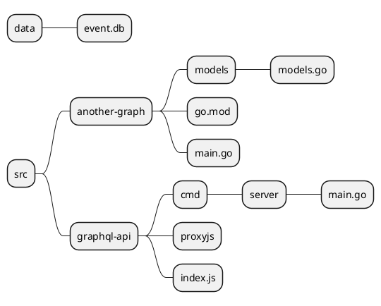
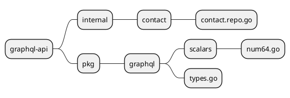

# Module 10: Advanced Topic
## Lab10.1 - GraphQL Federation Gateway
**Objective:** ประยุกต์ใช้ Gateway เมื่อต้องมี GraphQL Server หลายตัวที่ทำหน้าที่ต่างกัน
**ไฟล์ทีี่เกี่ยวข้องใน Lab นี้**

**10.1.1 สร้าง GraphQL Server เพื่อดึงข้อมูลผู้ใช้งานจาก Api**
**ขั้นตอน**
1. สร้างโปรเจค another-graph เพื่่อจำลอง graphql server อีกตัว เพิ่ม folder another-graph ภายใน src
2. เพิ่มโค้ด models/models.go  ดังนี้

```go
package models


type Name struct {
	Title string `json:"title"`
	First string `json:"first"`
	Last  string `json:"last"`
}

type Street struct {
	Number int    `json:"number"`
	Name   string `json:"name"`
}

type Coordinates struct {
	Latitude  string `json:"latitude"`
	Longitude string `json:"longitude"`
}

type Timezone struct {
	Offset      string `json:"offset"`
	Description string `json:"description"`
}

type Location struct {
	Street      Street      `json:"street"`
	City        string      `json:"city"`
	State       string      `json:"state"`
	Country     string      `json:"country"`
	Postcode    int         `json:"postcode"`
	Coordinates Coordinates `json:"coordinates"`
	Timezone    Timezone    `json:"timezone"`
}

type Login struct {
	UUID     string `json:"uuid"`
	Username string `json:"username"`
	Password string `json:"password"`
	Salt     string `json:"salt"`
	MD5      string `json:"md5"`
	SHA1     string `json:"sha1"`
	SHA256   string `json:"sha256"`
}

type DOB struct {
	Date string `json:"date"`
	Age  int    `json:"age"`
}

type Registered struct {
	Date string `json:"date"`
	Age  int    `json:"age"`
}

type ID struct {
	Name  string `json:"name"`
	Value string `json:"value"`
}

type Picture struct {
	Large     string `json:"large"`
	Medium    string `json:"medium"`
	Thumbnail string `json:"thumbnail"`
}

type Result struct {
	Gender     string     `json:"gender"`
	Name       Name       `json:"name"`
	Location   Location   `json:"location"`
	Email      string     `json:"email"`
	Login      Login      `json:"login"`
	DOB        DOB        `json:"dob"`
	Registered Registered `json:"registered"`
	Phone      string     `json:"phone"`
	Cell       string     `json:"cell"`
	ID         ID         `json:"id"`
	Picture    Picture    `json:"picture"`
	Nat        string     `json:"nat"`
}

type Info struct {
	Seed    string `json:"seed"`
	Results int    `json:"results"`
	Page    int    `json:"page"`
	Version string `json:"version"`
}

type Data struct {
	Results []Result `json:"results"`
	Info    Info     `json:"info"`
}

```
3. เพิ่มโค้ดใน main.go ดังนี้

```go
package main

import (
	"encoding/json"
	"fmt"
	"io"
	"log"
	"net/http"

	"another-graph/models"

	"github.com/graphql-go/graphql"
	"github.com/graphql-go/handler"
)


func main() {
	// Define Name GraphQL Object
	nameType := graphql.NewObject(graphql.ObjectConfig{
		Name: "Name",
		Fields: graphql.Fields{
			"title": &graphql.Field{Type: graphql.String},
			"first": &graphql.Field{Type: graphql.String},
			"last":  &graphql.Field{Type: graphql.String},
		},
	})

	// Define Street GraphQL Object
	streetType := graphql.NewObject(graphql.ObjectConfig{
		Name: "Street",
		Fields: graphql.Fields{
			"number": &graphql.Field{Type: graphql.Int},
			"name":   &graphql.Field{Type: graphql.String},
		},
	})

	// Define Coordinates GraphQL Object
	coordinatesType := graphql.NewObject(graphql.ObjectConfig{
		Name: "Coordinates",
		Fields: graphql.Fields{
			"latitude":  &graphql.Field{Type: graphql.String},
			"longitude": &graphql.Field{Type: graphql.String},
		},
	})

	// Define Timezone GraphQL Object
	timezoneType := graphql.NewObject(graphql.ObjectConfig{
		Name: "Timezone",
		Fields: graphql.Fields{
			"offset":      &graphql.Field{Type: graphql.String},
			"description": &graphql.Field{Type: graphql.String},
		},
	})

	// Define Location GraphQL Object
	locationType := graphql.NewObject(graphql.ObjectConfig{
		Name: "Location",
		Fields: graphql.Fields{
			"street":      &graphql.Field{Type: streetType},
			"city":        &graphql.Field{Type: graphql.String},
			"state":       &graphql.Field{Type: graphql.String},
			"country":     &graphql.Field{Type: graphql.String},
			"postcode":    &graphql.Field{Type: graphql.Int},
			"coordinates": &graphql.Field{Type: coordinatesType},
			"timezone":    &graphql.Field{Type: timezoneType},
		},
	})

	// Define Login GraphQL Object
	loginType := graphql.NewObject(graphql.ObjectConfig{
		Name: "Login",
		Fields: graphql.Fields{
			"uuid":     &graphql.Field{Type: graphql.String},
			"username": &graphql.Field{Type: graphql.String},
			"password": &graphql.Field{Type: graphql.String},
			"salt":     &graphql.Field{Type: graphql.String},
			"md5":      &graphql.Field{Type: graphql.String},
			"sha1":     &graphql.Field{Type: graphql.String},
			"sha256":   &graphql.Field{Type: graphql.String},
		},
	})

	// Define DOB GraphQL Object
	dobType := graphql.NewObject(graphql.ObjectConfig{
		Name: "DOB",
		Fields: graphql.Fields{
			"date": &graphql.Field{Type: graphql.String},
			"age":  &graphql.Field{Type: graphql.Int},
		},
	})

	// Define Registered GraphQL Object
	registeredType := graphql.NewObject(graphql.ObjectConfig{
		Name: "Registered",
		Fields: graphql.Fields{
			"date": &graphql.Field{Type: graphql.String},
			"age":  &graphql.Field{Type: graphql.Int},
		},
	})

	// Define ID GraphQL Object
	idType := graphql.NewObject(graphql.ObjectConfig{
		Name: "ID",
		Fields: graphql.Fields{
			"name":  &graphql.Field{Type: graphql.String},
			"value": &graphql.Field{Type: graphql.String},
		},
	})

	// Define Picture GraphQL Object
	pictureType := graphql.NewObject(graphql.ObjectConfig{
		Name: "Picture",
		Fields: graphql.Fields{
			"large":     &graphql.Field{Type: graphql.String},
			"medium":    &graphql.Field{Type: graphql.String},
			"thumbnail": &graphql.Field{Type: graphql.String},
		},
	})

	// Define Result GraphQL Object
	resultType := graphql.NewObject(graphql.ObjectConfig{
		Name: "Result",
		Fields: graphql.Fields{
			"gender":     &graphql.Field{Type: graphql.String},
			"name":       &graphql.Field{Type: nameType},
			"location":   &graphql.Field{Type: locationType},
			"email":      &graphql.Field{Type: graphql.String},
			"login":      &graphql.Field{Type: loginType},
			"dob":        &graphql.Field{Type: dobType},
			"registered": &graphql.Field{Type: registeredType},
			"phone":      &graphql.Field{Type: graphql.String},
			"cell":       &graphql.Field{Type: graphql.String},
			"id":         &graphql.Field{Type: idType},
			"picture":    &graphql.Field{Type: pictureType},
			"nat":        &graphql.Field{Type: graphql.String},
		},
	})

	// Define Info GraphQL Object
	infoType := graphql.NewObject(graphql.ObjectConfig{
		Name: "Info",
		Fields: graphql.Fields{
			"seed":    &graphql.Field{Type: graphql.String},
			"results": &graphql.Field{Type: graphql.Int},
			"page":    &graphql.Field{Type: graphql.Int},
			"version": &graphql.Field{Type: graphql.String},
		},
	})

	// Define Data GraphQL Object
	dataType := graphql.NewObject(graphql.ObjectConfig{
		Name: "Data",
		Fields: graphql.Fields{
			"results": &graphql.Field{
				Type: graphql.NewList(resultType),
			},
			"info": &graphql.Field{Type: infoType},
		},
	})

	// Define the Query Object
	queryType := graphql.NewObject(graphql.ObjectConfig{
		Name: "Query",
		Fields: graphql.Fields{
			"data": &graphql.Field{
				Type: dataType,
				Resolve: func(p graphql.ResolveParams) (interface{}, error) {
					// Here you should fetch and return the actual data

					data, err := fetchUserData()
					if err != nil {
						return models.Data{}, nil
					}
					// fmt.Printf("result-random:%v", data)
					return data, nil
				},
			},
		},
	})

	// Create the Schema
	schema, err := graphql.NewSchema(graphql.SchemaConfig{
		Query: queryType,
	})
	if err != nil {
		log.Fatalf("failed to create new schema, error: %v", err)
	}

	// _ = schema // This schema object would be used by your GraphQL server
	// Create a GraphQL handler for HTTP requests
	graphqlHandler := handler.New(&handler.Config{
		Schema:     &schema,
		Pretty:     true,
		GraphiQL:   false, // Disable GraphiQL for subscriptions endpoint
		Playground: true,
	})


	// Serve GraphQL API at /graphql endpoint
	http.Handle("/graphql", graphqlHandler)
	server := &http.Server{
		Addr: fmt.Sprintf(":%v", 4001),
	}
	fmt.Printf("Server is running at http://localhost:%v/graphql\n", 4001)
	server.ListenAndServe()
}

// fetchUserData fetches data from the Random User API
func fetchUserData() (models.Data, error) {
	response, err := http.Get("https://randomuser.me/api/")
	if err != nil {
		return models.Data{}, err
	}
	defer response.Body.Close()

	body, err := io.ReadAll(response.Body)
	if err != nil {
		return models.Data{}, err
	}

	var user models.Data
	err = json.Unmarshal(body, &user)
	if err != nil {
		return models.Data{}, err
	}

	// fmt.Printf("resutl:%v", user)

	return user, nil
}

```
4. รัน graphql server เพื่อทดสอบ graphql query 

```bash
    go run main.go
```

*GraphQL query*

```graphql
{
  data {
    results {
      gender
      login {
        uuid
        username
        password
      }
      name {
        title
        first
        last
      }
      dob {
        date
        age
      }
      location {
        street {
          number
          name
        }
        city
      }
      picture {
        thumbnail
      }
    }
  }
}
```
**10.1.2 สร้าง GraphQL Proxy Server ด้วย Nodejs**
1. สร้างโฟลเดอร์ชื่อ proxy ภายใต้ src
2. เพิ่มไฟล์ package.json ป้อนโค้ด ดังนี้

```json
{
  "name": "proxyjs",
  "version": "1.0.0",
  "description": "Graphql Proxy Server",
  "main": "index.js",
  "scripts": {
    "test": "echo \"Error: no test specified\" && exit 1"
  },
  "author": "Apaichon Punopas",
  "license": "MIT",
  "dependencies": {
    "axios": "^1.7.2",
    "express": "^4.19.2",
    "graphql-tools": "^9.0.1",
    "graphql-yoga": "^5.3.1",
    "http-proxy-middleware": "^3.0.0",
    "node-fetch": "^3.3.2"
  }
}

```
3. ติดตั้ง nodejs library ที่ command line ของโฟลเดอร์ proxyjs พิมพ์

```bash
npm install
```
4. เพิ่มไฟล์ index.js เพิ่มโค้ด ดังนี้

```javascript
const express = require('express');
const axios = require('axios');
const { parse, visit } = require('graphql/language');
const { print } = require('graphql');

const app = express();
app.use(express.json());

let token =""
let headers = {}
async function login () {
    const data = await axios.post('http://localhost:4000/login', {
        user_name: "puppy",
        password: 'P@ssw0rd'
    })
    // console.log("token", data.data.token)
    token = data.data.token
    headers = {
        'Authorization': token // Include 'Bearer ' before the token
      };
}

login()

async function executeQuery(query, variables = {}) {
    const contactQuery = [];
    const userQuery = [];
  
    // Parse the GraphQL query
    const ast = parse(query);
  
    // Visit the AST and separate the queries for contacts and users
    visit(ast, {
      Field(node) {
        if (node.name.value === 'contacts') {
          contactQuery.push(node);
        } else if (node.name.value === 'data') {
          userQuery.push(node);
        }
      },
    });

    // console.log('contactQuery:',print(contactQuery))
  
    const contactsResponse = contactQuery.length > 0
      ? await axios.post('http://localhost:4000/graphql', {
          query: '{' +print({ kind: 'Document', definitions: contactQuery }) +'}',
          variables,
        }, { headers })
      : { data: { data: null } };
  
    const usersResponse = userQuery.length > 0
      ? await axios.post('http://localhost:4001/graphql', {
          query: '{' +print({ kind: 'Document', definitions: userQuery }) + '}',
          variables,
        }, { headers })
      : { data: { data: null } };
  
    return {
      data: {
        ...contactsResponse.data.data,
        ...usersResponse.data.data,
      },
    };
  }

app.post('/graphql', async (req, res) => {
    const { query, variables } = req.body;

    executeQuery(query, variables)
        .then(response => res.json (response.data))
        .catch(error => res.status(500).json({ message: `Error: ${error}` }));
});

app.listen(9009, () => console.log('Proxy server listening on port 9009'));
```

5. รัน proxy server ที่ command line

```javascript
ืnode index.js
# Proxy server listening on port 9009
```
6. รัน server ที่ graphql-api และ another-graph
7. ทดสอบเรียก graphql จากเครื่อง proxy server port 9009 แล้ว query contacts จะแยกส่งไปที่ เครื่อง port 4000 ส่วน data จะแยกส่งไปที่เครื่อง port 4001

```graphql
{
  data{
    results {
      gender
      login {
        uuid
        username
        password
      }
      name {
        title
        first
        last
      }
      dob {
        date
        age
      }
      location {
        street {
         number
         name
        }
        city
      }
      picture {
        thumbnail
      }
    }
  }
  contacts {
    getById(id: 2) {
    contact_id
      name
      first_name
      last_name
      gender_id
      dob
      email
      phone
      address
      photo_path
      created_at
      created_by
    }
  }
}

```

\* การสร้าง proxy server เพื่อส่งข้อมูลข้าม Server ข้ามแพลตฟอร์มด้วย Json การใช้ Nodejs หรือ ภาษา JavaScript จะทำได้ง่ายและสะดวกกว่าหลายๆภาษาที่เป็น Type Safe การใช้ภาษา Typesafe ทำหน้าที่นี้จะทำได้ค่อนข้างยากถึงยากมาก เพราะมีการแปลง type ไปมาหลายขั้นตอน และมีโอกาสผิดสูงมาก

## Lab10.2 - Custom Type
**Objective:** สร้าง Graphql Type สำหรับรองรับ Int64 และ Float64 
**ไฟล์ทีี่เกี่ยวข้องใน Lab นี้**



**ขั้นตอน**
1. สร้างไฟล์ pkg/graphql/scalars/num64.go เพิ่มโค้ด ดังนี้

```go
package scalar

import (
	"strconv"

	"github.com/graphql-go/graphql"
	"github.com/graphql-go/graphql/language/ast"
)

// Define the Int64 custom scalar type
var Int64Type = graphql.NewScalar(graphql.ScalarConfig{
	Name:        "Int64",
	Description: "The `Int64` scalar type represents a signed 64-bit numeric non-fractional value.",
	Serialize: func(value interface{}) interface{} {
		switch v := value.(type) {
		case int64:
			return v
		case *int64:
			return *v
		case int:
			return int64(v)
		case *int:
			return int64(*v)
		case float64:
			return int64(v)
		case *float64:
			return int64(*v)
		default:
			return nil
		}
	},
	ParseValue: func(value interface{}) interface{} {
		switch v := value.(type) {
		case int64:
			return v
		case *int64:
			return *v
		case int:
			return int64(v)
		case *int:
			return int64(*v)
		case float64:
			return int64(v)
		case *float64:
			return int64(*v)
		case string:
			i, err := strconv.ParseInt(v, 10, 64)
			if err == nil {
				return i
			}
		}
		return nil
	},
	ParseLiteral: func(valueAST ast.Value) interface{} {
		switch v := valueAST.(type) {
		case *ast.IntValue:
			i, err := strconv.ParseInt(v.Value, 10, 64)
			if err == nil {
				return i
			}
		}
		return nil
	},
})


// Define Float64 scalar
var Float64Type = graphql.NewScalar(graphql.ScalarConfig{
	Name:        "Float64",
	Description: "The `Float64` scalar type represents signed double-precision fractional values.",
	Serialize: func(value interface{}) interface{} {
		switch v := value.(type) {
		case float64:
			return v
		case *float64:
			return *v
		case float32:
			return float64(v)
		case *float32:
			return float64(*v)
		case int:
			return float64(v)
		case *int:
			return float64(*v)
		default:
			return nil
		}
	},
	ParseValue: func(value interface{}) interface{} {
		switch v := value.(type) {
		case float64:
			return v
		case *float64:
			return *v
		case float32:
			return float64(v)
		case *float32:
			return float64(*v)
		case int:
			return float64(v)
		case *int:
			return float64(*v)
		case string:
			f, err := strconv.ParseFloat(v, 64)
			if err == nil {
				return f
			}
		}
		return nil
	},
	ParseLiteral: func(valueAST ast.Value) interface{} {
		switch v := valueAST.(type) {
		case *ast.FloatValue:
			f, err := strconv.ParseFloat(v.Value, 64)
			if err == nil {
				return f
			}
		case *ast.IntValue:
			i, err := strconv.ParseInt(v.Value, 10, 64)
			if err == nil {
				return float64(i)
			}
		}
		return nil
	},
})
```

2. นำ Type Int64 ไปใช้กับ ContactTypeGraphQL ที่ไฟล์ pkg/graphql/types.go จากเดิมที่ใช้ Type Int ดังนี้

```go
import (
    ...
	"graphql-api/pkg/graphql/scalar"
)

var ContactGraphQLType = graphql.NewObject(graphql.ObjectConfig{
	Name: "Contact",
	Fields: graphql.Fields{
		"contact_id": &graphql.Field{Type: scalar.Int64Type},// Change here
		"name":       &graphql.Field{Type: graphql.String},
		"first_name": &graphql.Field{Type: graphql.String},
		"last_name":  &graphql.Field{Type: graphql.String},
		"gender_id":  &graphql.Field{Type: graphql.Int},
		"dob":        &graphql.Field{Type: graphql.DateTime},
		"email":      &graphql.Field{Type: graphql.String},
		"phone":      &graphql.Field{Type: graphql.String},
		"address":    &graphql.Field{Type: graphql.String},
		"photo_path": &graphql.Field{Type: graphql.String},
		"created_at": &graphql.Field{Type: graphql.DateTime},
		"created_by": &graphql.Field{Type: graphql.String},
		// Add field here
	},
})
```

3. แก้โค้ดที่ internal/contact/contact.repo.go ในฟังก์ชัน Insert หรือฟังก์ชั่นต่างๆที่เคยแปลง int64 จาก Sqlite เป็น int ให้กลับมาใช้ int64

```go
// Insert Contact inserts a new contact into the database
func (cr *ContactRepo) InsertContact(contact *models.ContactModel) (int64, error) {
	// Execute insert query to insert a new contact into the database
	result, err := cr.DB.Insert("INSERT INTO contact (name,first_name,last_name,gender_id,dob,email,phone,address,photo_path,created_at,created_by) VALUES (?,?,?,?,?,?,?,?,?,?,?)",
		 contact.Name, contact.FirstName, contact.LastName, contact.GenderId, contact.Dob, contact.Email, contact.Phone, contact.Address, contact.PhotoPath, contact.CreatedAt, contact.CreatedBy)
	if err != nil {
		return 0, err
	}
	return result.LastInsertId()
}
```

4. ทดสอบฟังก์ชั่น createContact ใน graphql


