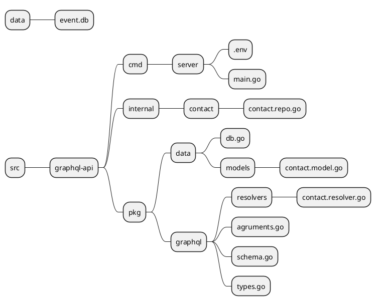
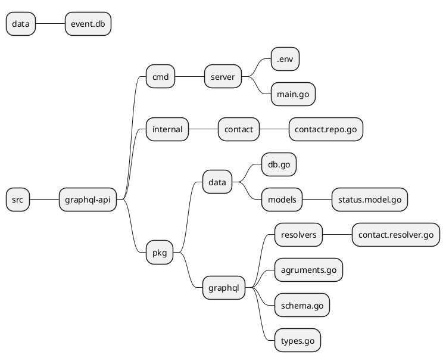

# Module 5: Mutation
## Lab5.1 - Create the contact data.
**Objective:** Understand how to create a Mutation function to add data to the Contact table with GraphQL.
**Related files in this lab**

1. Add function *InsertContact* in the file *internal/contact/contact.repo.go* as follows
```go
// Insert Contact inserts a new contact into the database
func (cr *ContactRepo) InsertContact(contact *models.ContactModel) (int64, error) {
	// Execute insert query to insert a new contact into the database
	result, err := cr.DB.Insert("INSERT INTO contact (name,first_name,last_name,gender_id,dob,email,phone,address,photo_path,created_at,created_by) VALUES (?,?,?,?,?,?,?,?,?,?,?)",
		 contact.Name, contact.FirstName, contact.LastName, contact.GenderId, contact.Dob, contact.Email, contact.Phone, contact.Address, contact.PhotoPath, contact.CreatedAt, contact.CreatedBy)
	if err != nil {
		return 0, err
	}
	return result.LastInsertId()
}
```
2. Add *CreateContactInput* and *CreateContactArgument* to the file */pkg/graphql/agruments.go*
```go
var CreateContactInput =  graphql.NewInputObject(graphql.InputObjectConfig{
	Name: "CreateContactsInput",
	Fields: graphql.InputObjectConfigFieldMap{
		"name":  {Type: graphql.NewNonNull(graphql.String)},
		"first_name":  {Type: graphql.NewNonNull(graphql.String)},
		"last_name":  {Type: graphql.NewNonNull(graphql.String)},
		"gender_id":  {Type: graphql.NewNonNull(graphql.Int)},
		"dob":  {Type: graphql.NewNonNull(graphql.DateTime)},
		"email": {Type: graphql.NewNonNull(graphql.String)},
		"address": {Type: graphql.String},
		"phone": {Type: graphql.String},
		"photo_path": {Type: graphql.String},
	},
})

var CreateContactArgument = graphql.FieldConfigArgument{
	"input": &graphql.ArgumentConfig{
		Type: CreateContactInput,
	},
}
```
3. Add function CreateContactResolve in pkg/graphql/resolvers/contact.resolver.go
```go
func CretateContactResolve(params graphql.ResolveParams) (interface{}, error) {
	// Map input fields to Contact struct
	input := params.Args["input"].(map[string]interface{})
	invalids := validateContact(input)

	if len(invalids) > 0 {
		return nil, fmt.Errorf("%v", invalids)
	}

	contactInput := models.ContactModel{

		Name:      input["name"].(string),
		FirstName: input["first_name"].(string),
		LastName:  input["last_name"].(string),
		GenderId:  input["gender_id"].(int),
		Dob:       input["dob"].(time.Time),
		Email:     input["email"].(string),
		Phone:     input["phone"].(string),
		Address:   input["address"].(string),
		PhotoPath: input["photo_path"].(string),
		CreatedBy: "test-api",
		CreatedAt: time.Now(),
	}

	contactRepo := contact.NewContactRepo()

	// Insert Contact to the database
	id, err := contactRepo.InsertContact(&contactInput)
	if err != nil {
		return nil, err
	}
	contactInput.ContactId = int64(id)
	return contactInput, nil
}
```
4. Add *ContactMutation* to file *pkg/graphql/types.go*
```go
// Define the ContactMutations type
var ContactMutationsType = graphql.NewObject(graphql.ObjectConfig{
	Name: "ContactMutations",
	Fields: graphql.Fields{
		"createContact": &graphql.Field{
			Type:    ContactGraphQLType,
			Args:    CreateContactArgument,
			Resolve: resolvers.CretateContactResolve,
		},
	},
})
```
5. Add field *ContactMutations* in file *pkg/graphql/schema.go*
```go
// RootQuery represents the root GraphQL query.
var RootMutation = graphql.NewObject(
	graphql.ObjectConfig{
		Name: "RootMutation",
		Fields: graphql.Fields{
			"contactMutations": &graphql.Field{
				Type: ContactMutationsType,
				Resolve: func(p graphql.ResolveParams) (interface{}, error) {
					return &ContactMutations{}, nil
				},
			},
			// Add other queries as needed
		},
	},
)
```
6. Test insert data from sending GraphQL Query.

**Query**
```graphql
mutation CreateContact($input: CreateContactInput) {
  contactMutations {
    createContact(input: $input) {
      contact_id
    }
  }
}
```
**Variables**
```graphql
{
  "input": {
    "name": "Dr.PUP",
    "first_name": "PUP",
    "last_name": "Apaichon",
    "gender_id": 1,
    "dob": "1979-11-13T00:00:00Z",
    "email": "john@example.com",
    "phone": "123-456-7890",
    "address": "123 Main St",
    "photo_path": "path/to/photo.jpg"
  }
}
```


*Figure 5.1 Create Contact Mutation.*

## Lab5.2 - Create the contact data with Validation.
**Objective:** Understand how to write functions for Validation Input before sending it to add data to the Mutation database.
**Related files in this lab**
1. Add Library *github.com/go-playground/validator/v10* to help validate input to the root project.
```sh
go get github.com/go-playground/validator/v10
```
2. Add function validateContact and insert functions before inserting data.

```go
import (
	"fmt"
	"graphql-api/internal/contact"
	"graphql-api/pkg/data/models"
	"time"

	"github.com/go-playground/validator/v10" // add validator
	"github.com/graphql-go/graphql"
)
var validate *validator.Validate

func init() {
	validate = validator.New(validator.WithRequiredStructEnabled())
}

func validateContact(contactInput map[string]interface{}) map[string]interface{} {
	rules := map[string]interface{}{
		"name":       "required",
		"first_name": "required",
		"last_name":  "required",
		"email":      "omitempty,required,email"}
	errs := validate.ValidateMap(contactInput, rules)
	return errs
}

func CreateContactResolve(params graphql.ResolveParams) (interface{}, error) {
	// Map input fields to Contact struct
	input := params.Args["input"].(map[string]interface{})
	invalids := validateContact(input) // Add in CreateContactResolve.

	if len(invalids) > 0 { // Check error validation.
		return nil, fmt.Errorf("%v", invalids)
	}

	contactInput := models.ContactModel{

		Name:      input["name"].(string),
		FirstName: input["first_name"].(string),
		LastName:  input["last_name"].(string),
		GenderId:  input["gender_id"].(int),
		Dob:       input["dob"].(time.Time),
		Email:     input["email"].(string),
		Phone:     input["phone"].(string),
		Address:   input["address"].(string),
		PhotoPath: input["photo_path"].(string),
		CreatedBy: "test-api",
		CreatedAt: time.Now(),
	}

	contactRepo := contact.NewContactRepo()

	// Insert Contact to the database
	id, err := contactRepo.InsertContact(&contactInput)
	if err != nil {
		return nil, err
	}
	contactInput.ContactId = int64(id)
	return contactInput, nil
}
```
3. Test by inserting data from GraphQL. Try not to enter values ​​in name, first_name, last_name or email in the wrong format.

**Query**
```graphql
mutation CreateContact($input: CreateContactInput) {
  contactMutations {
    createContact(input: $input) {
      contact_id
    }
  }
}
```
**Variables**
```graphql
{
  "input": {
    "name": "PUP",
    "first_name": "PUP",
    "last_name": "Apaichon",
    "gender_id": 1,
    "dob": "1979-11-13T00:00:00Z",
    "email": "john@example.com",
    "phone": "123-456-7890",
    "address": "123 Main St",
    "photo_path": "path/to/photo.jpg"
  }
}
```

*Figure 5.2 Create Contact Mutation with validation.*

## Lab5.3 - Update the contact data.
**Objective:** Understand how to write functions for Edit data in the database with Mutation.
**Related files in this lab**


1. Add function *UpdateContact* in the file *internal/contact/contact.repo.go* as follows
```go
func UpdateContactResolve(params graphql.ResolveParams) (interface{}, error) {
	// Map input fields to Contact struct
	input := params.Args["input"].(map[string]interface{})
	invalids := validateContact(input)

	if len(invalids) > 0 {
		return nil, fmt.Errorf("%v", invalids)
	}

	contactInput := models.ContactModel{

		ContactId: int64(input["contact_id"].(int)),
		Name:      input["name"].(string),
		FirstName: input["first_name"].(string),
		LastName:  input["last_name"].(string),
		GenderId:  input["gender_id"].(int),
		Dob:       input["dob"].(time.Time),
		Email:     input["email"].(string),
		Phone:     input["phone"].(string),
		Address:   input["address"].(string),
		PhotoPath: input["photo_path"].(string),
		CreatedBy: "test-api",
		CreatedAt: time.Now(),
	}

	contactRepo := contact.NewContactRepo()

	// Update Contact to the database
	_, err := contactRepo.UpdateContact(&contactInput)
	if err != nil {
		return nil, err
	}

	return contactInput, nil
}
```
2. Add *UpdateContactInput* and *CreateContactArgument* to the file */pkg/graphql/agruments.go*
```go
var UpdateContactArgument = graphql.FieldConfigArgument{
	"input": &graphql.ArgumentConfig{
		Type: graphql.NewInputObject(graphql.InputObjectConfig{
			Name: "UpdateContactInput",
			Fields: graphql.InputObjectConfigFieldMap{
				"contact_id":  {Type: graphql.NewNonNull(graphql.Int)},
				"name":  {Type: graphql.NewNonNull(graphql.String)},
				"first_name":  {Type: graphql.NewNonNull(graphql.String)},
				"last_name":  {Type: graphql.NewNonNull(graphql.String)},
				"gender_id":  {Type: graphql.NewNonNull(graphql.Int)},
				"dob":  {Type: graphql.NewNonNull(graphql.DateTime)},
				"email": {Type: graphql.NewNonNull(graphql.String)},
				"address": {Type: graphql.String},
				"phone": {Type: graphql.String},
				"photo_path": {Type: graphql.String},
			},
		}),
	},
}
```
3. Add function UpdateContactResolve in pkg/graphql/resolvers/contact.resolver.go
```go
func UpdateContactResolve(params graphql.ResolveParams) (interface{}, error) {
	// Map input fields to Contact struct
	input := params.Args["input"].(map[string]interface{})
	invalids := validateContact(input)

	if len(invalids) > 0 {
		return nil, fmt.Errorf("%v", invalids)
	}

	contactInput := models.ContactModel{

		ContactId: int64(input["contact_id"].(int)),
		Name:      input["name"].(string),
		FirstName: input["first_name"].(string),
		LastName:  input["last_name"].(string),
		GenderId:  input["gender_id"].(int),
		Dob:       input["dob"].(time.Time),
		Email:     input["email"].(string),
		Phone:     input["phone"].(string),
		Address:   input["address"].(string),
		PhotoPath: input["photo_path"].(string),
		CreatedBy: "test-api",
		CreatedAt: time.Now(),
	}

	contactRepo := contact.NewContactRepo()

	// Update Contact to the database
	_, err := contactRepo.UpdateContact(&contactInput)
	if err != nil {
		return nil, err
	}

	return contactInput, nil
}
```
4. Add *ContactMutation* to file *pkg/graphql/types.go*
```go
type ContactMutations struct {
	CreateContact func(map[string]interface{}) (*models.ContactModel, error) `json:"createContact"`
	UpdateContact func(map[string]interface{}) (*models.ContactModel, error) `json:"updateContact"`	
}

// Define the ContactMutations type
var ContactMutationsType = graphql.NewObject(graphql.ObjectConfig{
	Name: "ContactMutations",
	Fields: graphql.Fields{
		"createContact": &graphql.Field{
			Type:    ContactGraphQLType,
			Args:    CreateContactArgument,
			Resolve: resolvers.CretateContactResolve,
		},
		"updateContact": &graphql.Field{
			Type:    ContactGraphQLType,
			Args:    UpdateContactArgument,
			Resolve: resolvers.UpdateContactResolve,
		},
	},
})

```
5. Test insert data from sending GraphQL Query.

**Query**
```graphql
mutation UpdateContact($input: UpdateContactInput) {
  contactMutations {
 updateContact(input: $input) {
    contact_id
    name
    first_name
    }
  }
}
```
**Variables**
```graphql
{
  "input": {
    "contact_id": 5,
    "name": "Apaichon555",
    "first_name": "John555",
    "last_name": "Doe555",
    "gender_id": 1,
    "dob": "1990-01-01T00:00:00Z",
    "email": "john@example.com",
    "phone": "123-456-7890",
    "address": "123 Main St",
    "photo_path": "path/to/photox.jpg"
  }
}
```


## Lab5.4 - Delete the contact data.
**Objective:** Understand how to write functions for Delete data in the database with Mutation
**Related files in this lab**


1. Add function *DeleteContact* in the file *internal/contact/contact.repo.go* as follows
```go
func DeleteContactResolve(params graphql.ResolveParams) (interface{}, error) {
	// Map input fields to Contact struct
	contact_id := params.Args["id"].(int)

	contactRepo := contact.NewContactRepo()

	// Insert Contact to the database
	_, err := contactRepo.DeleteContact(contact_id)
	if err != nil {
		return nil, err
	}
	result:= models.Status {
		StatusID: 200,
		StatusText: "OK",
		Message: fmt.Sprintf("Delete id:%v successfully.", contact_id),
	}

	return result, nil
}
```
2. Add function DeleteContactResolve in pkg/graphql/resolvers/contact.resolver.go
```go
func DeleteContactResolve(params graphql.ResolveParams) (interface{}, error) {
	contact_id := params.Args["id"].(int)

	contactRepo := contact.NewContactRepo()

	// Delete Contact to the database
	_, err := contactRepo.DeleteContact(contact_id)
	if err != nil {
		return nil, err
	}
	result:= models.Status {
		StatusID: 200,
		StatusText: "OK",
		Message: fmt.Sprintf("Delete id:%v successfully.", contact_id),
	}

	return result, nil
}
```
3. Add *ContactMutation* to file *pkg/graphql/types.go*
```go
type ContactMutations struct {
	CreateContact func(map[string]interface{}) (*models.ContactModel, error) `json:"createContact"`
	UpdateContact func(map[string]interface{}) (*models.ContactModel, error) `json:"updateContact"`
	DeleteContact func(int) (*models.Status, error) `json:"deleteContact"`		
}

// Define the ContactMutations type
var ContactMutationsType = graphql.NewObject(graphql.ObjectConfig{
	Name: "ContactMutations",
	Fields: graphql.Fields{
		"createContact": &graphql.Field{
			Type:    ContactGraphQLType,
			Args:    CreateContactArgument,
			Resolve: resolvers.CretateContactResolve,
		},
		"updateContact": &graphql.Field{
			Type:    ContactGraphQLType,
			Args:    UpdateContactArgument,
			Resolve: resolvers.UpdateContactResolve,
		},
		"deleteContact": &graphql.Field{
			Type:    StatusGraphQLType,
			Args:    IdArgument,
			Resolve: resolvers.DeleteContactResolve,
		},
	},
})

```
4. Test insert data from sending GraphQL Query.

**Query**
```graphql
mutation {
  contactMutations {
    deleteContact(id: 6) {
      status_id
      status
      message
    }
  }
}
```

## Lab5.5 - Multiple insert data with exist mutation.
**Objective:** Understand how to write GraphQuery Mutations to insert multiple data items from existing Mutations.
**Related files in this Lab**
Use the same group of files from the insert example.

**Query**
```graphql
mutation CreateContact($input: CreateContactInput, $input2: CreateContactInput) {
  contactMutations {
    contact1: createContact(input: $input) {
      contact_id
    }
    contact2: createContact(input: $input2) {
      contact_id
    }
  }
}
```

**Variables**
```graphql
{
  "input": {
    "name": "",
    "first_name": "PUP",
    "last_name": "Apaichon",
    "gender_id": 1,
    "dob": "1979-11-13T00:00:00Z",
    "email": "john@example.com",
    "phone": "123-456-7890",
    "address": "123 Main St",
    "photo_path": "path/to/photo.jpg"
  },
  "input2": {
    "name": "Dr.PUP2",
    "first_name": "PUP2",
    "last_name": "Apaichon2",
    "gender_id": 1,
    "dob": "1979-11-13T00:00:00Z",
    "email": "john@example.com",
    "phone": "123-456-7890",
    "address": "123 Main St",
    "photo_path": "path/to/photo.jpg"
  }
}
```


## Lab5.6 - Multiple insert data with best performance for database.
**Objective:** 
Understand how to write GraphQuery Mutations to insert multiple data items by adding Mutations to support adding large amounts of data that are suitable for batch operations in the database.
**Related files in this lab**
Use the same group of files from the insert example to add functions to different parts.
1. Add function *InsertContacts* in the file *internal/contact/contact.repo.go* as follows
```go
func (cr *ContactRepo) InsertContacts(contacts []*models.ContactModel) ( int64, error) {
  
	// Step 1: Query the count of records before insertion
    var countBefore int64
    row,err := cr.DB.QueryRow("SELECT COUNT(*) FROM contact")
	
    if err != nil {
        return 0, fmt.Errorf("failed to query count before insertion: %v", err)
    }
	row.Scan(&countBefore)

    // Begin a transaction by starting a deferred transaction
    _, err = cr.DB.Exec("BEGIN TRANSACTION")
    if err != nil {
        return 0, err
    }
    defer func() {
        // Rollback the transaction if there's an error and it hasn't been committed
        if err != nil {
            _, rollbackErr := cr.DB.Exec("ROLLBACK")
            if rollbackErr != nil {
                err = fmt.Errorf("rollback failed: %v, original error: %v", rollbackErr, err)
            }
            return
        }
        // Commit the transaction if no error occurred
        _, commitErr := cr.DB.Exec("COMMIT")
        if commitErr != nil {
            err = fmt.Errorf("commit failed: %v", commitErr)
        }
    }()

    // Prepare the SQL statement for batch insertion
    stmt, err := cr.DB.Prepare("INSERT INTO contact (name, first_name, last_name, gender_id, dob, email, phone, address, photo_path, created_at, created_by) VALUES " + placeholders(len(contacts)))
    if err != nil {
        return 0, err
    }
    defer stmt.Close()

    // Prepare the slice to hold the arguments for the prepared statement
    args := make([]interface{}, 0, len(contacts)*11)

    // Flatten the contacts into a single slice of values
    for _, contact := range contacts {
        args = append(args, contact.Name, contact.FirstName, contact.LastName, contact.GenderId, contact.Dob, contact.Email, contact.Phone, contact.Address, contact.PhotoPath, contact.CreatedAt, contact.CreatedBy)
    }

    // Execute the prepared statement with the concatenated values
    _, err = stmt.Exec(args...)
    if err != nil {
        return 0, err
    }

    var countAfter int64
    row, err = cr.DB.QueryRow("SELECT COUNT(*) FROM contact")
	row.Scan(&countAfter)
    if err != nil {
        return 0, fmt.Errorf("failed to query count after insertion: %v", err)
    }
	if countAfter != (countBefore + int64(len(contacts))) {
		return 0, fmt.Errorf("insert batch is not completed: %v", err)
	}

    return  countAfter, nil
}

// placeholders returns a string with n question marks separated by commas, for use in a SQL statement.
func placeholders(n int) string {
    if n <= 0 {
        return ""
    }
    return strings.Repeat("(?,?,?,?,?,?,?,?,?,?,?),", n-1) + "(?,?,?,?,?,?,?,?,?,?,?)"
}
```
2. Add *CreateContactsArgument* to file */pkg/graphql/agruments.go*
```go
var CreateContactsArgument = graphql.FieldConfigArgument{
	"contacts": &graphql.ArgumentConfig{
		Type: graphql.NewNonNull(graphql.NewList(CreateContactInput)),
	},
}

```
3. Add function CreateContactsResolve in pkg/graphql/resolvers/contact.resolver.go
```go
func CreateContactsResolve(params graphql.ResolveParams) (interface{}, error) {
	// Map input fields to Contact struct
	contactsArg, ok := params.Args["contacts"].([]interface{})
	if !ok {
		return nil, fmt.Errorf("contacts argument not provided or has wrong type")
	}

	var contacts []*models.ContactModel
	for _, contact := range contactsArg {
		contactMap, ok := contact.(map[string]interface{})
		if !ok {
			return nil, fmt.Errorf("contact has wrong type")
		}
		contacts = append(contacts, &models.ContactModel{
			// Parse other fields as needed
			Name:      contactMap["name"].(string),
			FirstName: contactMap["first_name"].(string),
			LastName:  contactMap["last_name"].(string),
			GenderId:  contactMap["gender_id"].(int),
			Dob:       contactMap["dob"].(time.Time),
			Email:     contactMap["email"].(string),
			Phone:     contactMap["phone"].(string),
			Address:   contactMap["address"].(string),
			PhotoPath: contactMap["photo_path"].(string),
			CreatedBy: "test-api",
			CreatedAt: time.Now(),
		})
	}

	contactRepo := contact.NewContactRepo()

	// Insert Contact to the database
	total, err := contactRepo.InsertContacts(contacts)
	fmt.Println("total", total)
	if err != nil {
		return nil, err
	}
	result:= models.Status {
		StatusID: 200,
		StatusText: "OK",
		Message: fmt.Sprintf("Total Items:%v", total),
	}

	return result, nil
}
```

4. Add CreateContacts to *ContactMutation* in file *pkg/graphql/types.go*
```go
type ContactMutations struct {
	CreateContact func(map[string]interface{}) (*models.ContactModel, error) `json:"createContact"`
	CreateContacts func(map[string]interface{}) ([]*models.ContactModel, error) `json:"createContacts"`
	UpdateContact func(map[string]interface{}) (*models.ContactModel, error) `json:"updateContact"`
	DeleteContact func(int) (*models.Status, error) `json:"deleteContact"`		
}

// Define the ContactMutations type
var ContactMutationsType = graphql.NewObject(graphql.ObjectConfig{
	Name: "ContactMutations",
	Fields: graphql.Fields{
		"createContact": &graphql.Field{
			Type:    ContactGraphQLType,
			Args:    CreateContactArgument,
			Resolve: resolvers.CretateContactResolve,
		},
		"createContacts": &graphql.Field{
			Type:    StatusGraphQLType,
			Args:    CreateContactsArgument,
			Resolve: resolvers.CreateContactsResolve,
		},
		"updateContact": &graphql.Field{
			Type:    ContactGraphQLType,
			Args:    UpdateContactArgument,
			Resolve: resolvers.UpdateContactResolve,
		},
		"deleteContact": &graphql.Field{
			Type:    StatusGraphQLType,
			Args:    IdArgument,
			Resolve: resolvers.DeleteContactResolve,
		},
	},
})

```
5. Test insert data from sending GraphQL Query.

**Query**
```graphql
mutation CreateContact($contacts: [CreateContactInput]!) {
  contactMutations {
    createContacts(contacts: $contacts) {
      message
    }
  }
}
```

**Variables**
```graphql
{
  "contacts": [
    {
      "name": "Dr.PUP13",
      "first_name": "PUP13",
      "last_name": "Apaichon",
      "gender_id": 1,
      "dob": "1979-11-13T00:00:00Z",
      "email": "john@example.com",
      "phone": "123-456-7890",
      "address": "123 Main St",
      "photo_path": "path/to/photo.jpg"
    },
    {
      "name": "Dr.PUP11",
      "first_name": "PUP11",
      "last_name": "Apaichon2",
      "gender_id": 1,
      "dob": "1979-11-13T00:00:00Z",
      "email": "john@example.com",
      "phone": "123-456-7890",
      "address": "123 Main St",
      "photo_path": "path/to/photo.jpg"
    }
  ]
}
```
