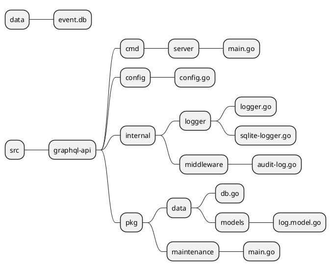
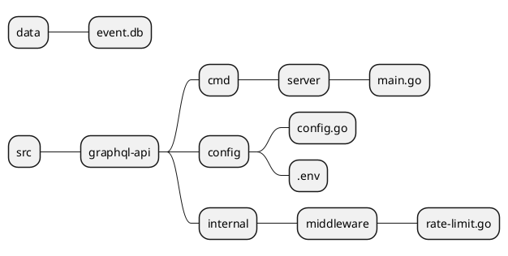
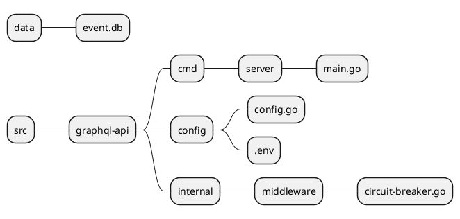

# Module 7: Middleware
## Lab7.1 - Audit Log
**Objective:** สร้างฟังก์ชั่นเก็บ Log รองรับ งาน Audit Log
**ไฟล์ทีี่เกี่ยวข้องใน Lab นี้**


1. สร้างฐานข้อมูลตาราง logs

```sql
CREATE TABLE IF NOT EXISTS logs (
    log_id TEXT PRIMARY KEY,
    timestamp DATETIME,
    user_id INTEGER,
    action TEXT,
    resource TEXT,
    status TEXT,
    client_ip TEXT,
    client_device TEXT,
    client_os TEXT,
    client_os_ver TEXT,
    client_browser TEXT,
    client_browser_ver TEXT,
    duration INTEGER, -- Using INTEGER to store duration in nanoseconds
    errors TEXT,
    created_at DATETIME DEFAULT CURRENT_TIMESTAMP
);

```

2. สร้างไฟล์ *internal/logger/logger.go*  สำหรับเขียน audit logs มีโค้ด ดังนี้
```go
package logger

import (
	"bufio"
	"encoding/json"
	"fmt"
	"graphql-api/config"
	"graphql-api/pkg/data/models"
	"log"
	"os"
	"path/filepath"
	"sort"
	"sync"
	"time"
)

type Logger struct {
	once        sync.Once
	currentFile *os.File
	currentPath string
	logMutex    sync.Mutex
}

// FileWithModTime is a struct to hold file information along with its modification time
type FileWithModTime struct {
	Name    string
	ModTime time.Time
	IsDir   bool
}

// The singleton instance of LogInitializer
var loggerInstance *Logger
var loggerOnce sync.Once
var relativePath string = "../../logs"

// GetLogInitializer returns the singleton instance of LogInitializer
func GetLogInitializer() *Logger {
	loggerOnce.Do(func() {
		loggerInstance = &Logger{}
	})
	return loggerInstance
}

// Initialize ensures that setup logic is done only once
func (li *Logger) Initialize() {
	li.once.Do(func() {
		relativePath := "../../logs"
		if err := os.MkdirAll(relativePath, 0755); err != nil {
			log.Fatalf("Error creating logs directory: %v", err)
		}
	})
}

// WriteLogToFile writes the log entry to a file, handling initialization and file management
func (li *Logger) WriteLogToFile(logEntry models.LogModel) {
	// Ensure initialization happens only once
	li.Initialize()
	conf := config.GetConfig()

	// Determine the log file name based on the current timestamp (every 5 minutes)
	logFileName := fmt.Sprintf("%04d-%02d-%02d-%02d_%02d.log",
		logEntry.Timestamp.Year(),
		logEntry.Timestamp.Month(),
		logEntry.Timestamp.Day(),
		logEntry.Timestamp.Hour(),
		(logEntry.Timestamp.Minute()/conf.LogMergeMin)*conf.LogMergeMin,
	)

	// relativePath := "../../logs"
	logFilePath := filepath.Join(relativePath, logFileName)
	absolutePath, err := filepath.Abs(logFilePath)
	if err != nil {
		log.Fatalf("Error obtaining absolute path: %v", err)
	}

	// Use a mutex to ensure thread safety
	li.logMutex.Lock()
	defer li.logMutex.Unlock()

	// If the current file path changes, close the previous file and open a new one
	if li.currentPath != absolutePath {
		if li.currentFile != nil {
			li.currentFile.Close()
		}

		li.currentPath = absolutePath

		// Open the new file
		li.currentFile, err = os.OpenFile(absolutePath, os.O_APPEND|os.O_CREATE|os.O_WRONLY, 0644)
		if err != nil {
			log.Fatalf("Error opening log file: %v", err)
		}
	}

	// Write the log entry as JSON to the file
	jsonData, err := json.Marshal(logEntry)
	if err != nil {
		log.Fatalf("Error marshaling log data: %v", err)
	}

	_, err = li.currentFile.Write(append(jsonData, '\n')) // Add newline
	if err != nil {
		log.Fatalf("Error writing to log file: %v", err)
	}
}

// Function to read the last log file and insert its content into SQLite
func (li *Logger) MoveLogsToSQLite() {

	absolutePath, err := filepath.Abs(relativePath)
	if err != nil {
		log.Printf("Error reading logs directory: %v", err)
		return
	}

	// Get and sort the files by the oldest modification time
	files, err := listFilesOrderedByOldest(absolutePath)
	if err != nil {
		log.Fatalf("Error reading directory: %v", err)
	}

	if len(files) == 0 {
		return // No logs to process
	}

	// Read the log file and insert into SQLite
	logFilePath := filepath.Join(absolutePath, files[0].Name)
	file, err := os.Open(logFilePath)
	if err != nil {
		log.Printf("Error opening log file: %v", err)
		return
	}

	defer file.Close()
	scanner := bufio.NewScanner(file)
	var logList []models.LogModel
	for scanner.Scan() {
		var logEntry models.LogModel
		if err := json.Unmarshal([]byte(scanner.Text()), &logEntry); err != nil {
			log.Printf("Error unmarshaling log data: %v", err)
			continue
		}

		log.Printf("Error inserting into SQLite: %v", logEntry)
		logList = append(logList, logEntry)
		// fmt.Printf("%v", logList)
	}

	logger := NewSqliteLogger()
	logger.InsertLog(logList)

	// Delete the log file after processing
	err = os.Remove(logFilePath)
	if err != nil {
		log.Printf("Error deleting log file: %v", err)
	}

}

// Read and sort files by modification time in ascending order (oldest to newest)
func listFilesOrderedByOldest(path string) ([]FileWithModTime, error) {
	// Read the directory
	files, err := os.ReadDir(path)
	if err != nil {
		return nil, err
	}

	var fileInfos []FileWithModTime

	// Get file information and modification time
	for _, file := range files {
		info, err := file.Info() // Get detailed information about the file
		if err != nil {
			return nil, err
		}

		fileInfos = append(fileInfos, FileWithModTime{
			Name:    file.Name(),
			ModTime: info.ModTime(), // Use ModTime as a proxy for creation time
			IsDir:   file.IsDir(),
		})
	}

	// Sort files by modification time
	sort.Slice(fileInfos, func(i, j int) bool {
		return fileInfos[i].ModTime.Before(fileInfos[j].ModTime) // Ascending order
	})

	return fileInfos, nil
}

```

3. สร้าง *internal/logger/sqlite-log.go* สำหรับ insert ข้อมูลลงฐานข้อมูล logs มีโค้ด ดังนี้

```go
package logger

import (
	"fmt"
	"graphql-api/pkg/data"
	"graphql-api/pkg/data/models"
	_ "github.com/mattn/go-sqlite3"
)

// ContactRepo represents the repository for contact operations
type SqliteLogger struct {
	DB *data.DB
}

// NewContactRepo creates a new instance of ContactRepo
func NewSqliteLogger() *SqliteLogger {
	db := data.NewDB()
	return &SqliteLogger{DB: db}
}


// Insert multiple LogModel entries into the SQLite database
func (logger *SqliteLogger) InsertLog( logEntries []models.LogModel) error {
	// Prepare the SQL insert statement
	query := `
    INSERT INTO logs (
        log_id,
        timestamp,
        user_id,
        action,
        resource,
        status,
        client_ip,
        client_device,
        client_os,
        client_os_ver,
        client_browser,
        client_browser_ver,
        duration,
        errors
    ) VALUES (?, ?, ?, ?, ?, ?, ?, ?, ?, ?, ?, ?, ?, ?)
    `

	// Prepare the SQL statement
	stmt, err := logger.DB.Prepare(query)
	if err != nil {
		return fmt.Errorf("error preparing insert statement: %w", err)
	}
	defer stmt.Close()

	// Iterate through the log entries and insert each one
	for _, logEntry := range logEntries {
		_, err := stmt.Exec(
			logEntry.LogId,
			logEntry.Timestamp,
			logEntry.UserId,
			logEntry.Actions,
			logEntry.Resource,
			logEntry.Status,
			logEntry.ClientIp,
			logEntry.ClientDevice,
			logEntry.ClientOs,
			logEntry.ClientOsVersion,
			logEntry.ClientBrowser,
			logEntry.ClientBrowserVersion,
			logEntry.Duration.Nanoseconds(),
			logEntry.Errors,
		)

		if err != nil {
			return fmt.Errorf("error inserting log: %w", err)
		}
	}

	return nil
}

```
4. สร้างไฟล์ *internal/middleware/audit-log.go* สำหรับนำฟังก์ชั่น Log มาใช้ในส่วนของ Middleware มีโค้ด ดังนี้
```go
package middleware

import (
	"bytes"
	"encoding/json"
	"fmt"
	"io"
	"log"
	"net/http"
	"strings"
	"time"
	"github.com/graphql-go/graphql/language/ast"
	"github.com/mssola/user_agent"
	"github.com/samborkent/uuidv7"
	"graphql-api/config"
	"graphql-api/internal/auth"
	"graphql-api/internal/logger"
	"graphql-api/pkg/data/models"
	"graphql-api/pkg/graphql"
	"graphql-api/pkg/graphql/utils"
	
)

// AuditLog represents an entry in the audit log.
type AuditLog struct {
	Timestamp   time.Time // Timestamp of the log entry
	Method      string    // HTTP method (POST, GET, etc.)
	URL         string    // Request URL
	RequestBody string    // Request body
	UserName    string    // User ID (if authenticated)
	Duration    time.Duration
	// Add more fields as needed
}

// CustomResponseWriter wraps the standard http.ResponseWriter
type CustomResponseWriter struct {
	http.ResponseWriter
	StatusCode int
	Status     string        // Captures the HTTP status code
	Body       *bytes.Buffer // Captures the response body
}

// Write captures the body content while writing to the underlying ResponseWriter
func (crw *CustomResponseWriter) Write(data []byte) (int, error) {
	crw.Body.Write(data)                  // Capture the response body
	return crw.ResponseWriter.Write(data) // Pass through to the original ResponseWriter
}

// WriteHeader captures the status code while writing the HTTP response
func (crw *CustomResponseWriter) WriteHeader(statusCode int) {
	crw.StatusCode = statusCode
	crw.ResponseWriter.WriteHeader(statusCode) // Pass through to the original ResponseWriter
}

// Middleware function to log GraphQL requests.
func AuditLogMiddleware(next http.Handler) http.Handler {
	return http.HandlerFunc(func(w http.ResponseWriter, r *http.Request) {
		start := time.Now()

		crw := &CustomResponseWriter{
			ResponseWriter: w,
			Body:           new(bytes.Buffer),
			StatusCode:     http.StatusOK, // Default to 200 OK
		}

		// Parse the GraphQL request from JSON
		var gqlRequest graphql.GraphQLRequest
		body, err := io.ReadAll(r.Body)
		r.Body = io.NopCloser(bytes.NewBuffer(body))

		if err == nil {
			if err = json.Unmarshal(body, &gqlRequest); err != nil {
				http.Error(w, "Invalid GraphQL request", http.StatusBadRequest)
				return
			}
		}

		// Call the next handler
		next.ServeHTTP(crw, r)
		writeLog(r, crw, gqlRequest.Query, start)
	})
}

func writeLog(r *http.Request, crw *CustomResponseWriter, query string, start time.Time) {
	logEntry := prepareLog(r, crw, query, start)

	fmt.Printf("Audit Log: %+v\n", logEntry)
	auditLog := logger.GetLogInitializer()

	// Start the log writing Go routine
	go auditLog.WriteLogToFile(*logEntry)
}

func prepareLog(r *http.Request, crw *CustomResponseWriter, bodyString string, start time.Time) *models.LogModel {

	uaString := r.Header.Get("User-Agent")
	token := r.Header.Get("Authorization")
	ip := r.RemoteAddr
	actions := transformGraphResolves(bodyString)
	// Parse the User-Agent
	ua := user_agent.New(uaString)
	// Get the browser name and version
	browserName, browserVersion := ua.Browser()
	// Get the operating system name
	osInfo := ua.OS()
	device := ua.Model()
	userId := getUserIdFromJWT(token)

	// Parse the GraphQL response
	var gqlResponse graphql.GraphQLResponse
	if err := json.NewDecoder(crw.Body).Decode(&gqlResponse); err != nil {
		log.Fatalf("Error decoding JSON response: %v", err)
	}
	errors := utils.ErrorsToString(gqlResponse.Errors)

	logData := &models.LogModel{
		LogId:                uuidv7.New().String(),
		Timestamp:            time.Now(),
		Duration:             time.Since(start),
		Status:               http.StatusText(crw.StatusCode),
		ClientIp:             ip,
		ClientBrowser:        browserName,
		ClientBrowserVersion: browserVersion,
		ClientOs:             osInfo,
		ClientOsVersion:      ua.OSInfo().Version,
		ClientDevice:         device,
		UserId:               userId,
		Actions:              actions,
		Resource:             "GraphQLApi",
		Errors:               errors,
	}

	return logData
}

func getUserIdFromJWT(token string) int {
	config := config.NewConfig()
	user, err := auth.DecodeJWTToken(token, config.SecretKey)
	userId := -1
	if err == nil {
		userId = user.UserId
	}

	return userId
}

func transformGraphResolves(query string) string {
	// Parse the GraphQL query into an AST
	document, err := utils.ParseGraphQLQuery(query)
	if err != nil {
		log.Fatalf("Failed to parse GraphQL query: %v", err)
	}

	// List to store the dot notation for "resolve" fields
	var resolveDotNotation []string

	// Find the first operation and generate dot notation for resolve fields
	for _, definition := range document.Definitions {
		if operation, ok := definition.(*ast.OperationDefinition); ok {
			utils.GenerateResolveDotNotation(operation.SelectionSet, "", &resolveDotNotation)
		}
	}

	methods := strings.Join(resolveDotNotation[:], ",")
	return methods
}

```

5. ที่ไฟล์ cmd/server/main.go นำ middleware audit-log มาครอบ เพื่อเก็บ log ทุก request

```go

import (
	...
	"graphql-api/internal/middleware"
)

auditLog := middleware.AuditLogMiddleware(graphqlHandler)
authen := auth.AuthenticationHandler(auditLog)
// Serve GraphQL API at /graphql endpoint
http.Handle("/graphql", authen)
```

6. สร้างโฟลเดอร์ชื่อ logs ให้ folder อยู่ level 1 ระดับเดียวกับ cmd, config, intrnal, pkg
7. แก้ไข config/.env  ให้มีการกำหนดค่า LOG_MERGE_MIN (สำหรับรวม log ในไฟล์เดียวกันทุกๆกี่นาที) และ LOG_MOVE_MIN (สำหรับ Background Process คอยย้าย log ไฟล์เก่าที่สุด ไปไว้ที่ database ทุกๆกี่นาที) ดังนี้
```env
LOG_MERGE_MIN=1
LOG_MOVE_MIN=2
```
8. แก้โค้ดที่ไฟล์ config.go
```go
package config

import (
	"fmt"
	"path/filepath"
	"sync"
	"github.com/joho/godotenv"
	"github.com/spf13/viper"
)

// Config represents application configuration
type Config struct {
	DBHost      string
	DBPort      int
	DBUser      string
	DBPassword  string
	DBName      string
	SecretKey   string
	TokenAge    int
	GraphQLPort int
	LogServerPort int
	LogMergeMin int
	LogMoveMin float64
	RateLimitReqSec int
	RateLimitBurst int
}


const (
    DBHost     = "DB_HOST"
    DBPort     = "DB_PORT"
    DBUser     = "DB_USER"
    DBPassword = "DB_PASSWORD"
    DBName     = "DB_NAME"
    SecretKey  = "SECRETE_KEY"
    TokenAge   = "TOKEN_AGE"
    GraphQLPort = "GRAPHQL_PORT"
    LogServerPort = "LOG_SERVER_PORT"
    LogMergeMin   = "LOG_MERGE_MIN"
    LogMoveMin    = "LOG_MOVE_MIN"
	RateLimitReqSec    = "RATE_LIMIT_REQ_SEC"
	RateLimitBurst   = "RATE_LIMIT_BURST"
)

var instance *Config
var once sync.Once

// LoadConfig loads the configuration from environment variables
func NewConfig() *Config {
	once.Do(func() {
		relativePath := "../../config/.env"

		// Get the absolute path
		absolutePath, err := filepath.Abs(relativePath)
        if err != nil {
            fmt.Println(err)
            return
        }
		// Load environment variables from .env file
		if err := godotenv.Load(absolutePath); err != nil {
			fmt.Println("Failed to load env variables:", err)
			return
		}

		viper.AutomaticEnv()

		// Create a Config instance and set values from Viper
		instance = &Config{
			DBHost:     viper.GetString(DBHost),
			DBPort:     viper.GetInt(DBPort),
			DBUser:     viper.GetString(DBUser),
			DBPassword: viper.GetString(DBPassword),
			DBName:     viper.GetString(DBName),
			SecretKey:  viper.GetString(SecretKey),
			TokenAge:   viper.GetInt(TokenAge),
			GraphQLPort: viper.GetInt(GraphQLPort),
			LogServerPort: viper.GetInt(LogServerPort),
			LogMergeMin:   viper.GetInt(LogMergeMin),
			LogMoveMin:    viper.GetFloat64(LogMoveMin),
			RateLimitReqSec:   viper.GetInt(RateLimitReqSec),
			RateLimitBurst:    viper.GetInt(RateLimitBurst),
		}
	})
	return instance
}

// GetConfig returns the singleton configuration instance
func GetConfig() *Config {
	return instance
}

```
9. รันโปรเจคแล้วทำการเรียกใช้ Query และ Mutation ต่างๆ ให้ตรวจสอบ Folder logs มีไฟล์เพิ่มขึ้นมาหรือไม่
10. เปิด terminal ใหม่ แล้วรัน Background Process เพื่อ maintain logs ให้ย้ายไปเก็บไว้ใน Database 
```sh
#pkg/maintenance
go run main.go
```
11. รอ 2 นาที เมื่อไฟล์ logs หายไป ลองเช็คข้อมูลในฐานข้อมูล log
```sql
--sqlite
select * from logs
```

## Lab7.2 - Rate Limit
**Objective:** สร้างฟังก์ชั่นสำหรับกำหนด Rate Limit ให้ระบบ
**ไฟล์ทีี่เกี่ยวข้องใน Lab นี้**


1. สร้างไฟล์ *internal/middleware/rate-limit.go* เพื่อสร้างฟังก์ชั่นสำหรับทำ Rate Limit มีโค้ด ดังนี้
```go
package middleware

import (
	"net/http"
	"golang.org/x/time/rate"
)

// Define the rate limiter middleware
func RateLimitMiddleware(limit rate.Limit, burst int) func(http.Handler) http.Handler {
	limiter := rate.NewLimiter(limit, burst)

	return func(next http.Handler) http.Handler {
		return http.HandlerFunc(func(w http.ResponseWriter, r *http.Request) {
			// Check if the request exceeds the rate limit
			if !limiter.Allow() {
				http.Error(w, "Rate limit exceeded", http.StatusTooManyRequests)
				return
			}

			// Proceed to the next handler if the rate limit is not exceeded
			next.ServeHTTP(w, r)
		})
	}
}

```
2. แก้ไข config/.env  ให้มีการกำหนดค่า Request per secs (สำหรับจำกัดจำนวน Request ต่อวินาที) และ Burst (สำหรับ Block การส่ง Request เมื่อจำนวน Request per sec เกินโควต้า) ดังนี้
```env
RATE_LIMIT_REQ_SEC=1
RATE_LIMIT_BURST=5
```
3. ที่ไฟล์ cmd/server/main.go นำ middleware rate-limit มาครอบ เพื่อเพิ่มฟีเจอร์ rate limit
```go
	rateLimitReqSec := viper.GetInt("RATE_LIMIT_REQ_SEC")
	rateLimitBurst := viper.GetInt("RATE_LIMIT_BURST")
	limit := rate.Every(time.Duration(rateLimitReqSec) * time.Second)
	auditLog := middleware.AuditLogMiddleware(graphqlHandler)
	rateLimit := middleware.RateLimitMiddleware(limit, rateLimitBurst)(auditLog)
	authen := auth.AuthenticationHandler(rateLimit)

	// Serve GraphQL API at /graphql endpoint
	http.Handle("/graphql", authen)

```
4. ทดสอบยิง Query หลายๆครั้งเกิน 5 ครั้ง

## Lab7.3 - Circuit Breaker
**Objective:** สร้างฟังก์ชั่นสำหรับกำหนด Circuit Breaker ให้ระบบตัดการทำงานเมื่อมีฟังก์ชั่นไหน Process ใช้เวลานานกว่าที่กำหนด
**ไฟล์ทีี่เกี่ยวข้องใน Lab นี้**

1. สร้างไฟล์ *internal/middleware/circuit-breaker.go* เพื่อสร้างฟังก์ชั่นสำหรับทำ Circuit Breaker มีโค้ด ดังนี้
```go
package middleware

import (
	"context"
	"errors"
	"net/http"
	"time"

	"github.com/graphql-go/graphql"
)


// Higher-order function that wraps a resolver with timeout handling
func CircuitBreakerResolver(resolver graphql.FieldResolveFn, timeout time.Duration) graphql.FieldResolveFn {
	return func(p graphql.ResolveParams) (interface{}, error) {
		// Create a context with timeout
		ctx, cancel := context.WithTimeout(p.Context, timeout)
		defer cancel()

		// Create a channel to signal completion or timeout
		done := make(chan struct{}, 1)
		defer close(done)

		// Execute the resolver within a goroutine
		go func() {
			// Call the resolver
			_, err := resolver(p)
			if err != nil {
				// If resolver returns an error, send it through the channel
				done <- struct{}{}
			}
		}()

		// Wait for either completion or timeout
		select {
		case <-done:
			return nil, errors.New("resolver execution error")
		case <-ctx.Done():
			// Timeout occurred
			return nil, errors.New("timeout occurred")
		}
	}
}
// Middleware function signature
type Middleware func(http.Handler) http.Handler

func CircuitBreakerMiddleware(timeout time.Duration) Middleware {
    return func(next http.Handler) http.Handler {
        return http.HandlerFunc(func(w http.ResponseWriter, r *http.Request) {
            // Create a context with timeout
            ctx, cancel := context.WithTimeout(r.Context(), timeout)
            defer cancel()

            // Create a channel to signal completion or timeout
            done := make(chan struct{}, 1)
            // defer close(done)

            // Execute the handler within a goroutine
            go func() {
                next.ServeHTTP(w, r)
                done <- struct{}{}
            }()

            // Wait for either completion or timeout
            select {
            case <-done:
                return
            case <-ctx.Done():
                // Timeout occurred
                http.Error(w, "Request timeout", http.StatusRequestTimeout)
            }
        })
    }
}

```

2. แก้ไข config/.env  ให้มีการกำหนดค่า Exec Timeout หน่วยวินาที หากมีการใช้เวลาประมวลผลนานเกิน ดังนี้
```env
EXEC_TIME_OUT=5
```
3. ที่ไฟล์ cmd/server/main.go นำ middleware rate-limit มาครอบ เพื่อเพิ่มฟีเจอร์ rate limit
```go
	rateLimitReqSec := viper.GetInt("RATE_LIMIT_REQ_SEC")
	rateLimitBurst := viper.GetInt("RATE_LIMIT_BURST")
	limit := rate.Every( (time.Duration(rateLimitReqSec) * time.Second))
	execTimeOut := viper.GetInt("EXEC_TIME_OUT")
	auditLog := middleware.AuditLogMiddleware(graphqlHandler)
	rateLimit := middleware.RateLimitMiddleware(limit, rateLimitBurst)(auditLog)
	circuitBreaker := middleware.CircuitBreakerMiddleware(time.Duration(execTimeOut) * time.Second)(rateLimit)

	// Serve GraphQL API at /graphql endpoint
	http.Handle("/graphql", circuitBreaker)

```

4. ที่ *pkg/graphql/resolvers/contact.resolver.go* เพิ่ม time.Sleep(1 * time.Minute) ในไฟังก์ชั่น GetContactResolve เพื่อ ให้ใช้เวบาประมวล 1 นาที 
```go
func GetContactResolve(params graphql.ResolveParams) (interface{}, error) {
	// Update limit and offset if provided
	limit, ok := params.Args["limit"].(int)
	if !ok {
		limit = 10
	}

	offset, ok := params.Args["offset"].(int)
	if !ok {
		offset = 0
	}

	searchText, ok := params.Args["searchText"].(string)
	if !ok {
		searchText = ""
	}
	contactRepo := contact.NewContactRepo()

	// Fetch contacts from the database
	contacts, err := contactRepo.GetContactsBySearchText(searchText, limit, offset)
	if err != nil {
		return nil, err
	}
	// Add to long run process
	time.Sleep(1 * time.Minute)
	return contacts, nil
}

```
5. ทดสอบยิง Query 
```graphql
{
  contacts {
    gets(searchText: "") {
      name
      first_name
      last_name
      gender_id
      dob
      email
      phone
      address
      photo_path
      created_at
      created_by
    }
  }
}
```

## Lab7.4 - Documentation
**Objective:** Generate Document สำหรับทีมหรือ partner
https://github.com/2fd/graphdoc#use
1. ติดตั้ง Library graphdoc ของ Nodejs
```bash
 # Command Line
 npm install -g @2fd/graphdoc
```

2. ปิดโหมด Authentication ในโปรเจค graphql-api แล้วรันใหม่
3. Generate เอกสาร
 ```bash
  graphdoc -e http://localhost:4000/graphql -o ./docs/schema
  ```


