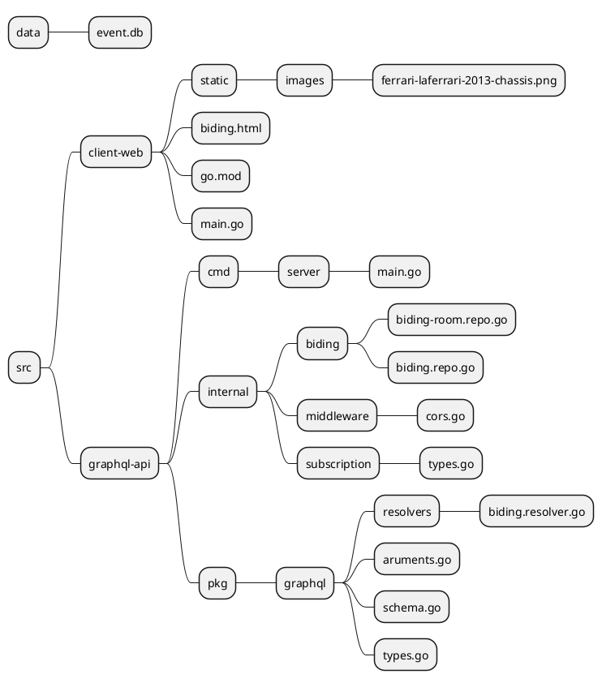
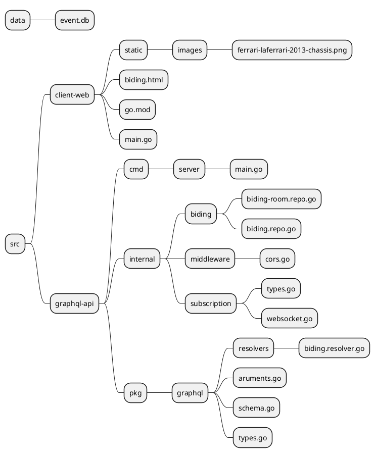

# Module 9: Subscription and Real-Time Updates
## Lab9.1 - Web Integration
**Objective:** สามารถประยุกต์ใช้ Graphql เชื่อมต่อกับ Frontend
**ไฟล์ทีี่เกี่ยวข้องใน Lab นี้**

**ขั้นตอน**
1. เตรียมข้อมูลตาราง biding_room สำหรับเก็บข้อมูลห้อง Biding และตาราง bidding สำหรับเก็บข้อมูลการ biding
```sql
CREATE TABLE biding_room (
    room_id INTEGER PRIMARY KEY AUTOINCREMENT,
    start_date DATETIME NOT NULL,
    end_date DATETIME NOT NULL,
    product_name TEXT NOT NULL,
    floor_price REAL NOT NULL,
    product_image TEXT
);

CREATE TABLE biding (
    bid_id INTEGER PRIMARY KEY AUTOINCREMENT,
    room_id INTEGER,
    bidder TEXT NOT NULL,
    bid_price REAL NOT NULL,
    bid_time DATETIME NOT NULL,
    FOREIGN KEY (room_id) REFERENCES biding_roomRoom (room_id)
);
```
2. เพิ่มตัวอย่างข้อมูลห้องสำหรับ Biding 
```sql
INSERT INTO biding_room (start_date, end_date, product_name, floor_price, product_image)
VALUES ('2024-05-23', '2024-06-20', 'LaFerrari 2013', 20000000.00, 'static/images/ferrari-laferrari-2013-chassis.png');

```

3. สร้าง struct ใน golang ไว้ mapping ข่้อมูล biding room และ biding ที่ไฟล์ pkg/data/models/bidding-room.model.go และ biding.model.go ตามลำดับ

 ```go
// bidin-room.model.go

package models

import (
	"time"
)
// BidingRoom represents the biding_room table
type BidingRoomModel struct {
    RoomId      int       `json:"room_id"`
    StartDate   time.Time `json:"start_date"`
    EndDate     time.Time `json:"end_date"`
    ProductName string    `json:"product_name"`
    FloorPrice  float64   `json:"floor_price"`
    ProductImage string   `json:"product_image"`
}

// biding.model.go
package models

import (
	"time"
)
// Biding represents the biding table
type BidingModel struct {
    BidId    int       `json:"bid_id"`
    RoomId   int       `json:"room_id"`
    Bidder   string    `json:"bidder"`
    BidPrice float64   `json:"bid_price"`
    BidTime  time.Time `json:"bid_time"`
}

 ```

 4. สร้าง Repository ใน Go สำหรับ Query ข้อมูลจาก ตาราง bidding_room และ bidding ที่ไฟล์ internal/biding/biding-room.repo.go และ biding.repo.go  ป้อนโค้ด ดังนี้

 ```go
 // biding-room.repo.go
 package biding

import (
	"fmt"
	"graphql-api/pkg/data"
	"graphql-api/pkg/data/models"

	_ "github.com/mattn/go-sqlite3"
)

// BidingRepo represents the repository for contact operations
type BidingRoomRepo struct {
	DB *data.DB
}

// NewBidingRepo creates a new instance of BidingRepo
func NewBidingRoomRepo() *BidingRoomRepo {
	db := data.NewDB()
	return &BidingRoomRepo{DB: db}
}

// Get ContactByID retrieves a contact by its ID from the database
func (cr *BidingRoomRepo) GetRoomById(roomId int) (*models.BidingRoomModel, error) {
	var room models.BidingRoomModel
	// Execute query to get a contact by ID from the database
	row, err := cr.DB.QueryRow("SELECT * FROM biding_room WHERE room_id = ?", roomId)
	fmt.Printf("roomId:%v row:%v", roomId, row)
	if err != nil {
		return &room, nil
	}

	row.Scan(
		&room.RoomId,
		&room.StartDate,
		&room.EndDate,
		&room.ProductName,
		&room.FloorPrice,
		&room.ProductImage,
	)

	return &room, nil
}

```

```go
 // biding.repo.go
 package biding

import (
	"graphql-api/pkg/data"
	"graphql-api/pkg/data/models"
	_ "github.com/mattn/go-sqlite3"
)

// BidingRepo represents the repository for contact operations
type BidingRepo struct {
	DB *data.DB
}

// NewBidingRepo creates a new instance of BidingRepo
func NewBidingRepo() *BidingRepo {
	db := data.NewDB()
	return &BidingRepo{DB: db}
}

// Get Contacts fetches contacts from the database with support for text search, limit, and offset
func (cr *BidingRepo) GetTop5(roomId  int) ([]*models.BidingModel, error) {
	var top5 []*models.BidingModel

	query := `SELECT * FROM biding
             Where  room_id = ? order by bid_price desc, bid_time desc limit 5`

	rows, err := cr.DB.Query(query,roomId)
	if err != nil {
		return nil, err
	}
	defer rows.Close()

	for rows.Next() {
		var biding models.BidingModel
		err := rows.Scan(
			&biding.BidId,
			&biding.RoomId,
			&biding.Bidder,
			&biding.BidPrice,
			&biding.BidTime,
		
		)
		if err != nil {
			return nil, err
		}
		top5 = append(top5, &biding)
	}

	if err := rows.Err(); err != nil {
		return nil, err
	}

	return top5, nil
}

// Insert Contact inserts a new contact into the database
func (bd *BidingRepo) InsertBiding(biding *models.BidingModel) (int64, error) {
	// Execute insert query to insert a new biding into the database

	result, err := bd.DB.Insert("INSERT INTO biding (room_id,bidder,bid_price, bid_time) VALUES (?,?,?,?)",
		 biding.RoomId,biding.Bidder, biding.BidPrice, biding.BidTime)
	if err != nil {
		return 0, err
	}
	return result.LastInsertId()
}

```
5. เพิ่ม Agruments สำหรับสร้าง Biding ที่ไฟล์ pkg/graphql/agruments.go

```go
var CreateBidingInput = graphql.NewInputObject(graphql.InputObjectConfig{
	Name: "CreateBidingInput",
	Fields: graphql.InputObjectConfigFieldMap{
		"room_id":   {Type: graphql.NewNonNull(graphql.Int)},
		"bidder":    {Type: graphql.NewNonNull(graphql.String)},
		"bid_price": {Type: graphql.NewNonNull(graphql.Float)},
		"bid_time":  {Type: graphql.NewNonNull(graphql.DateTime)},
	},
})

var CreateBidingArgument = graphql.FieldConfigArgument{
	"input": &graphql.ArgumentConfig{
		Type: CreateBidingInput,
	},
}

```
6. เขียน Graphql Resolver สำหรับ ดึงข้อมูล Biding room, insert biding และ  ดึงข้อมูล top 5 biding ที่ไฟล์ pkg/grapql/resolvers/biding.resolver.go

```go
package resolvers

import (
	"fmt"
	"strconv"
	"time"
	"graphql-api/internal/biding"
	"graphql-api/internal/cache"
	"graphql-api/pkg/data/models"
	"github.com/graphql-go/graphql"
)

func GetBidingRoomByIdResolve(params graphql.ResolveParams) (interface{}, error) {
	id := params.Args["id"].(int)
	bidingRoomRepo := biding.NewBidingRoomRepo()

	// Fetch biding room from the database
	bidingRoom, err := bidingRoomRepo.GetRoomById(id)
	fmt.Printf("Biding room:%v", bidingRoom)
	if err != nil {
		return nil, err
	}
	go cache.SetCacheResolver(params, bidingRoom)
	return bidingRoom, nil
}

func GetBidingTop5Resolve(params graphql.ResolveParams) (interface{}, error) {
	id := params.Args["id"].(int)
	bidingRepo := biding.NewBidingRepo()

	// Fetch biding room from the database
	biding, err := bidingRepo.GetTop5(id)
	if err != nil {
		return nil, err
	}
	go cache.SetCacheResolver(params, biding)
	return biding, nil
}

//BidingResolve
func CreateBidingResolve(params graphql.ResolveParams) (interface{}, error) {
	// Map input fields to Biding struct
	input := params.Args["input"].(map[string]interface{})
	bidingInput := models.BidingModel{
		RoomId: input["room_id"].(int),
		Bidder:  input["bidder"].(string),
		BidPrice:  input["bid_price"].(float64),
		BidTime:       time.Now(),
	}

	bidingRepo := biding.NewBidingRepo()

	// Insert Biding to the database
	id, err := bidingRepo.InsertBiding(&bidingInput)
	if err != nil {
		return nil, err
	}

	bidingId := int(id)
	bidingInput.BidId = bidingId
	go cache.RemoveGetCacheResolver("BidingQueries")

}


```
7. Mapping data model กับ graphql types ที่ไฟล์ pkg/graphql/types.go

```go

var BidingRoomGraphQLType = graphql.NewObject(
	graphql.ObjectConfig{
		Name: "BidingRoom",
		Fields: graphql.Fields{
			"room_id": &graphql.Field{
				Type: graphql.Int,
			},
			"start_date": &graphql.Field{
				Type: graphql.DateTime,
			},
			"end_date": &graphql.Field{
				Type: graphql.DateTime,
			},
			"product_name": &graphql.Field{
				Type: graphql.String,
			},
			"floor_price": &graphql.Field{
				Type: graphql.Float,
			},
			"product_image": &graphql.Field{
				Type: graphql.String,
			},
		},
	},
)

var BidingGraphQLType = graphql.NewObject(
	graphql.ObjectConfig{
		Name: "Biding",
		Fields: graphql.Fields{
			"bid_id": &graphql.Field{
				Type: graphql.Int,
			},
			"room_id": &graphql.Field{
				Type: graphql.Int,
			},
			"bidder": &graphql.Field{
				Type: graphql.String,
			},
			"bid_price": &graphql.Field{
				Type: graphql.Float,
			},
			"bid_time": &graphql.Field{
				Type: graphql.DateTime,
			},
		},
	},
)

type BidingQueries struct {
	GetRoomById   func(int) (*models.BidingRoomModel, error) `json:"getRoomById"`
	GetTop5Biding func(int) ([]*models.BidingModel, error)   `json:"getTop5Biding"`
}

// Define the TicketQueries type
var BidingQueriesType = graphql.NewObject(graphql.ObjectConfig{
	Name: "BidingQueries",
	Fields: graphql.Fields{
		"getRoomById": &graphql.Field{
			Type:    BidingRoomGraphQLType,
			Args:    IdArgument,
			Resolve: resolvers.GetBidingRoomByIdResolve,
		},
		"getTop5Biding": &graphql.Field{
			Type:    graphql.NewList(BidingGraphQLType),
			Args:    IdArgument,
			Resolve: resolvers.GetBidingTop5Resolve,
		},
	},
})

type BidingMutations struct {
	CreateBiding  func(map[string]interface{}) (*models.BidingModel, error)   `json:"createBiding"`
}


// Define the ContactMutations type
var BidingMutationsType = graphql.NewObject(graphql.ObjectConfig{
	Name: "BidingMutations",
	Fields: graphql.Fields{
		"createBiding": &graphql.Field{
			Type:    BidingGraphQLType,
			Args:    CreateBidingArgument,
			Resolve:  resolvers.CreateBidingResolve,
		},

	},
})

```

8. เพิ่ม Grapql type และ resolver ใน RootQuery และ RootMutation ที่ไฟล์ schema.go
```go
var RootQuery = graphql.NewObject(
	graphql.ObjectConfig{
		Name: "RootQuery",
		Fields: graphql.Fields{
			...
				"biding": &graphql.Field{
				Type: BidingQueriesType,
				Resolve: func(p graphql.ResolveParams) (interface{}, error) {
					return &BidingQueries{}, nil
				},
			},

var RootMutation = graphql.NewObject(
	graphql.ObjectConfig{
		Name: "RootMutation",
		Fields: graphql.Fields{
			...
			"bidingMutations": &graphql.Field{
				Type: BidingMutationsType,
				Resolve: func(p graphql.ResolveParams) (interface{}, error) {
					return &BidingMutations{}, nil
				},
			},
```
9. ทดสอบดึงข้อมูล Bidding room, Insert Bidding และ Get Top 5 Bidding จาก Graphql
*Get Biding Room*
```graphql

 {
  biding {
    getRoomById(id:1) {
      room_id
      start_date
      end_date
      product_name
      floor_price
      product_image
    }
  }
  
}

``` 
*Biding Mutation*
```graphql
mutation CreateBiding($input: CreateBidingInput) {
  bidingMutations {
    createBiding(input: $input) {
      bid_id
    }
  }
}
```
*Variables*
```json
{
  "input": {
    "room_id": 1,
    "bidder": "Test Bidder",
    "bid_price": 50000,
    "bid_time": "1979-11-13T00:00:00Z"
  }
}
```
10. สร้างโฟลเดอร์ใหม่ระดับเดียวกันกับ graphql-api ชื่อ client-web
11. สร้างโฟลเดอร์ static/images ทำการเพิ่มรูปสินค้าที่ต้องการแล้วทำการแก้ product_image ที่ตาราง biding_room
12. สร้างไฟล์ biding.html ปัอนโค้ด ดังนี้
```html
<!DOCTYPE html>
<html lang="en">

<head>
    <meta charset="UTF-8">
    <meta name="viewport" content="width=device-width, initial-scale=1.0">
    <title>Bidding System</title>
    <script src="https://cdn.tailwindcss.com"></script>
</head>

<body class="bg-gray-100 font-sans leading-normal tracking-normal">

    <div class="container mx-auto p-4">
        <div class="flex justify-between items-center mb-6">
            <h1 class="text-3xl font-bold">Biding</h1>
            <p id="userInfo"></p>
            <div class="text-center">
                <h2 class="text-lg font-semibold">Count Down</h2>
                <div id="countdown" class="text-2xl font-bold">00:00</div>
            </div>
        </div>

        <div class="grid grid-cols-3 gap-6">
            <div class="col-span-1">
                <h2 class="text-2xl font-bold mb-4">Top 5</h2>
                <ul id="topBids" class="space-y-4">
                    <!-- Top bids will be dynamically inserted here -->
                </ul>
            </div>

            <div class="col-span-2">
                <div class="bg-white p-6 rounded-lg shadow-lg">
                    <h2 id="productName" class="text-xl font-bold"></h2>
                    <p id="floorPrice" class="text-gray-700"></p>
                    
                    <div class="flex items-center space-x-4">

                        <input type="number" id="bidAmount" placeholder="BIDING PRICE"
                            class="w-full p-2 border rounded-lg" min="20000000">
                        <button onclick="addBid()" class="bg-black text-white px-4 py-2 rounded-lg">Submit</button>
                    </div>
                </div>
            </div>
        </div>
    </div>
    <div id="messages"></div>

    <script>
        const bids = [];
        const TOP5_QUERY = 
        `{
        biding {
            top5:getTop5Biding(id:1) {
                bidId:bid_id
                roomId:room_id
                bidder
                bidPrice:bid_price
                bidTime:bid_time
            }
        }
        }`

        const CREATE_BID_MUTATION = 
        `mutation CreateBiding($input: CreateBidingInput) {
            bidingMutations {
                createBiding(input: $input) {
                bid_id
                room_id
                bidder
                bid_time
                bid_price
                }
            }
        }`

        async function addBid() {
            const amount = parseFloat(document.getElementById('bidAmount').value);
            const bidder = getDataFromSessionStorage("bidder")
            const room = getDataFromLocalStorage("bidingRoom")
            const biding = { room_id: room.room_id, bidder: bidder.user, bid_price: amount, bid_time: new Date() }

            //console.log(biding)
            if (!isNaN(amount)) {
                // Insert to database
                const result = await createBid(biding)
                // get top5
                const data = await fetchData(TOP5_QUERY)
                bidingTopBids(data.biding.top5)
            }
        }

        async function createBid(biding) {
            try {
                // Replace this URL with your GraphQL API endpoint
                const token = getCookie('token')

                const response = await fetch('http://localhost:4000/graphql', {
                    method: 'POST',
                    headers: {
                        'Content-Type': 'application/json',
                        'Authorization': token
                    },
                    body: JSON.stringify({ query: CREATE_BID_MUTATION, variables: { input: biding } }),
                });

                const { data } = await response.json();
                return data
                // ...
            } catch (error) {
                console.error('Error create data:', error);
            }
        }

        // Function to bind the JSON data to the HTML elements
        function bindData(data) {
            console.log('data', data)
            const productNameElement = document.getElementById('productName');
            const floorPriceElement = document.getElementById('floorPrice');
            const productImageElement = document.getElementById('productImage');
            //const data = data.getRoomById

            productNameElement.textContent = `Product: ${data.productName}`;
            floorPriceElement.textContent = `Floor Price: ${data.floorPrice.toLocaleString()}`;
            productImageElement.src = data.productImage;
        }

        function formatDate(date) {
            const year = date.getFullYear();
            const month = String(date.getMonth() + 1).padStart(2, '0');
            const day = String(date.getDate()).padStart(2, '0');
            const hours = String(date.getHours()).padStart(2, '0');
            const minutes = String(date.getMinutes()).padStart(2, '0');
            const seconds = String(date.getSeconds()).padStart(2, '0');

            return `${year}-${month}-${day} ${hours}:${minutes}:${seconds}`;
        }


        function bidingTopBids(data) {
            const topBids = document.getElementById('topBids');
            topBids.innerHTML = '';

            for (let i = 0; i < 5 && i < data.length; i++) {
                const bid = data[i];
                const li = document.createElement('li');
                li.className = `flex items-center space-x-3 p-2 rounded-lg ${getColorClass(i)}`;
                li.innerHTML = `
                    <div class="text-lg font-bold">${i + 1}</div>
                    <div class="flex-1 h-4 rounded-full bg-gray-200">
                       
                        <div class="h-full rounded-full" style="width: ${100 - i * 20}%;font-size:12px;color:black;text-align: center;">${formatDate(new Date(bid.bidTime))}</div>
                       
                    </div>
                    <div class="text-lg font-semibold">${bid.bidPrice.toLocaleString()}</div>
                    <div class="text-lg font-semibold"> ${bid.bidder}</div>
                `;
                topBids.appendChild(li);
            }
        }

        function updateTopBids() {
            const topBids = document.getElementById('topBids');
            topBids.innerHTML = '';

            for (let i = 0; i < 5 && i < bids.length; i++) {
                const bid = bids[i];
                const li = document.createElement('li');
                li.className = `flex items-center space-x-3 p-2 rounded-lg ${getColorClass(i)}`;
                li.innerHTML = `
                    <div class="text-lg font-bold">${i + 1}</div>
                    <div class="flex-1 h-4 rounded-full bg-gray-200">
                        <div class="h-full rounded-full" style="width: ${100 - i * 20}%"></div>
                    </div>
                    <div class="text-lg font-semibold">${bid.toLocaleString()}</div>
                `;
                topBids.appendChild(li);
            }
        }

        function getColorClass(index) {
            switch (index) {
                case 0: return 'bg-pink-500 text-white';
                case 1: return 'bg-yellow-400 text-white';
                case 2: return 'bg-blue-500 text-white';
                case 3: return 'bg-teal-400 text-white';
                default: return 'bg-gray-200 text-gray-800';
            }
        }

        function setDataToSessionStorage(key, data) {
            sessionStorage.setItem(key, JSON.stringify(data));
        }

        function removeDataFromSessionStorage(key) {
            sessionStorage.removeItem(key);
        }

        function getDataFromSessionStorage(key) {
            const data = sessionStorage.getItem(key);
            return data ? JSON.parse(data) : null;
        }

        // List of random names
        const firstNames = ['John', 'Emily', 'Michael', 'Sophia', 'David', 'Olivia', 'Daniel', 'Ava', 'Matthew', 'Emma'];
        const lastNames = ['Smith', 'Johnson', 'Williams', 'Jones', 'Brown', 'Davis', 'Miller', 'Wilson', 'Moore', 'Taylor'];

        // Function to generate a random user
        function generateRandomUser() {
            const firstName = firstNames[Math.floor(Math.random() * firstNames.length)];
            const lastName = lastNames[Math.floor(Math.random() * lastNames.length)];
            const age = Math.floor(Math.random() * 61) + 20; // Random age between 20 and 80
            const userInfo = `${firstName} ${lastName}, ${age} years old`;
            return userInfo;
        }

        // Get the user info element
        const userInfoElement = document.getElementById('userInfo');
        // Define the GraphQL query
        const GET_BIDDING_ROOM_QUERY = 
        `{
            biding {
                getRoomById(id:1) {
                    room_id
                    start_date
                    end_date
                    productName:product_name
                    floorPrice:floor_price
                    productImage:product_image
                }
            top5:getTop5Biding(id:1) {
                    bidId:bid_id
                    roomId:room_id
                    bidder
                    bidPrice:bid_price
                    bidTime:bid_time
                }

            }
        }`;

        async function fetchData(query) {
            try {
                // Replace this URL with your GraphQL API endpoint
                const token = getCookie('token')
                const response = await fetch('http://localhost:4000/graphql', {
                    method: 'POST',
                    headers: {
                        'Content-Type': 'application/json',
                        'Authorization': token
                    },
                    body: JSON.stringify({ query: query }),
                });

                const { data } = await response.json();
                return data
                // ...
            } catch (error) {
                console.error('Error fetching data:', error);
            }
        }

        async function login() {
            try {
                // Replace this URL with your GraphQL API endpoint
                const response = await fetch('http://127.0.0.1:4000/login', {
                    method: 'POST',
                    headers: {
                        'Content-Type': 'application/json',
                    },
                    body: JSON.stringify({
                        "user_name": "puppy",
                        "password": "P@ssw0rd"
                    }),
                });

                const { token } = await response.json();
                setCookie('token', token, 1)
                return token
                // ...
            } catch (error) {
                console.error('Error fetching data:', error);
            }
        }

        function setCookie(name, value, days) {
            var expires = "";
            if (days) {
                var date = new Date();
                date.setTime(date.getTime() + (days * 24 * 60 * 60 * 1000));
                expires = "; expires=" + date.toUTCString();
            }
            document.cookie = name + "=" + (value || "") + expires + "; path=/";
        }

        function getCookie(name) {
            var nameEQ = name + "=";
            var ca = document.cookie.split(';');
            for (var i = 0; i < ca.length; i++) {
                var c = ca[i];
                while (c.charAt(0) == ' ') c = c.substring(1, c.length);
                if (c.indexOf(nameEQ) == 0) return c.substring(nameEQ.length, c.length);
            }
            return null;
        }

        function setDataToLocalStorage(key, data) {
            localStorage.setItem(key, JSON.stringify(data));
        }

        function getDataFromLocalStorage(key) {
            const data = localStorage.getItem(key);
            return data ? JSON.parse(data) : null;
        }

        function calculateRemainingTime() {
            const now = new Date().getTime();
            const bidingRoom = getDataFromLocalStorage('bidingRoom')
            const endDate = new Date(bidingRoom.end_date)
            const distance = endDate.getTime() - now;

            // Calculate days, hours, minutes, and seconds remaining
            const days = Math.floor(distance / (1000 * 60 * 60 * 24));
            const hours = Math.floor((distance % (1000 * 60 * 60 * 24)) / (1000 * 60 * 60));
            const minutes = Math.floor((distance % (1000 * 60 * 60)) / (1000 * 60));
            const seconds = Math.floor((distance % (1000 * 60)) / 1000);

            // Display the countdown clock
            const countdownElement = document.getElementById('countdown');
            countdownElement.innerHTML = `${days}d ${hours}h ${minutes}m ${seconds}s`;

            // Check if the countdown has reached the start date
            if (distance < 0) {
                clearInterval(countdownInterval);
                countdownElement.innerHTML = 'Countdown has started!';
            }
        }


        // Generate a random user when the page loads
        window.onload = async function () {
            const randomUser = generateRandomUser();
            userInfoElement.textContent = randomUser;
            const token = await login()
            const biddingRoom = await fetchData(GET_BIDDING_ROOM_QUERY)

            bindData(biddingRoom.biding.getRoomById)
            console.log(biddingRoom.biding.top5)
            const users = randomUser.split(',')
            setDataToSessionStorage('bidder', { user: users[0], age: users[1] })
            setDataToLocalStorage('bidingRoom', biddingRoom.biding.getRoomById)
            const data = await fetchData(TOP5_QUERY)
            console.log('top5', data)
            // bidingTopBids
            bidingTopBids(data.biding.top5)

        }

        // Update the countdown clock every second
        const countdownInterval = setInterval(calculateRemainingTime, 1000);
        // Calculate the initial remaining time
        calculateRemainingTime();

        async function readFromServer(text) {
            const correctedString = text.replace(/\\\"/g, '\"');
            let data = JSON.parse(correctedString);
            const { id, content, timestamp } = data

            const messagesDiv = document.getElementById('messages');
            const newMessage = document.createElement('div');

            newMessage.textContent = `ID: ${id}, Text: ${content}, CreatedAt: ${new Date(timestamp).toLocaleString()}`
            messagesDiv.appendChild(newMessage);
            const bidingData = await fetchData(TOP5_QUERY)

            // bidingTopBids
            bidingTopBids(bidingData.biding.top5)
        }
    </script>

</body>

</html>
```
12. สร้างไฟล์  main.go ป้อนโค้ด ดังนี้
```go
package main

import (
	"log"
	"net/http"
)

func main() {
	// Serve the biding.html file at the root URL
	http.HandleFunc("/", func(w http.ResponseWriter, r *http.Request) {
		http.ServeFile(w, r, "biding.html")
	})

	// Serve static files from the "static" directory
	staticDir := "./static"
	fileServer := http.FileServer(http.Dir(staticDir))
	http.Handle("/static/", http.StripPrefix("/static", fileServer))

	log.Println("Starting server on :8000")
	if err := http.ListenAndServe(":8000", nil); err != nil {
		log.Fatalf("Failed to start server: %v", err)
	}
}

```
13. รัน go run main.go
14. ทดสอบรัน web โดยเปิด Browser แล้วเข้าไปที่ localhost:8000 แล้่วลองทดสอบส่งข้อมูล Biding
 

 ## Lab9.2 - Implementing real-time data update with web socket
**Objective:** สามารถประยุกต์ใช้ Websocket เพื่อ update ข้อมูลแบบ Real-time
**ไฟล์ทีี่เกี่ยวข้องใน Lab นี้**

**ขั้นตอน**
1. เพื่มฟังก์ชั่นสำหรับ WebSockets ที่ internal/subscription/websocket.go เพิ่มโค้ด ดังนี้
```go
package subscription

import (
	"fmt"
	"net/http"
	"encoding/json"
	"github.com/gorilla/websocket"
	"github.com/graphql-go/graphql"
)
var upgrader = websocket.Upgrader{
	ReadBufferSize:  1024,
	WriteBufferSize: 1024,
	CheckOrigin: func(r *http.Request) bool {
		// Check the origin of the request here if needed
		return true
	},
}

func SubscribeWsHandler(schema graphql.Schema) http.HandlerFunc {
	return func(w http.ResponseWriter, r *http.Request) {

		ws, err := upgrader.Upgrade(w, r, nil)
		if err != nil {
			fmt.Println(err)
			return
		}
		defer ws.Close()

		messageChan := make(chan SubscribeMessage)
		SetSubcribe(messageChan)

		// Close the channel and remove the subscriber when done
		defer func() {
			DeleteSubcribe(messageChan)
			close(messageChan)
		}()

		for {
			select {
			case msg := <-messageChan:
				jsonBytes, err := json.Marshal(msg)
				if err != nil {
					fmt.Println(err)
				}
				// Write message back to browser
				if err := ws.WriteMessage(1, jsonBytes); err != nil {
					fmt.Println(err)
					return
				}
			case <-r.Context().Done():
				return
			}
		}
	}
}
```
2. ที่ไฟล์ cmd/server/main.go เพิ่ม WebSockets Route เพื่อให้มีช่องทางเชื่อมต่อสำหรับ client
```go
import(
 ...
 "graphql-api/internal/subscription"
)

func main() {
	...
	http.HandleFunc("/ws-subscribe", middleware.CorsHandler(subscription.SubscribeWsHandler(schema)))
}


```

3. ที่ web-client ไฟล์ biding.html เพื่มฟังก์ชั่นที่ฝั่ง Client เพื่อเชื่อมต่อ  Web Sockets ภายใน <script> เพื่ม
```javascript
/*
        Web Socket Subscribe
        */

        const ws = new WebSocket('ws://localhost:4000/ws-subscribe');

        ws.onopen = () => {
            const query = 
            `subscription {
                contactSubscriptions {
                    contactCreated{
                        id
                        content
                        timestamp
                    }
                }
            }`;
            ws.send(JSON.stringify({ query }));
        };

        ws.onmessage = (event) => {
            readFromServer(event.data)
        };

        ws.onerror = (error) => {
            console.error('WebSocket error:', error);
        };

        ws.onclose = () => {
            console.log('WebSocket connection closed');
        };

```

4. restart graphql, webclient เปืด browser หลายๆหน้าจอแล้วทดสอบส่งข้อมูล biding จะพบอัพเดตข้อมูลแบบ Real-time ทุกหน้าจอเมื่อมีการอัพเดตข้อมูล
